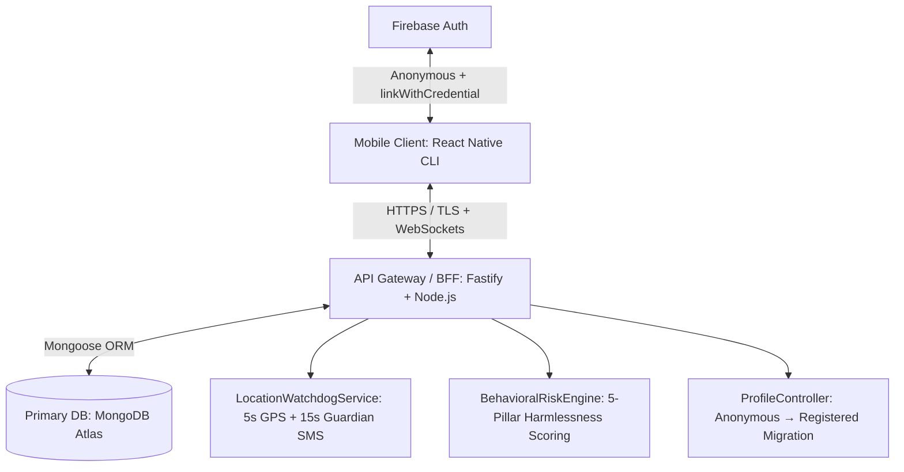
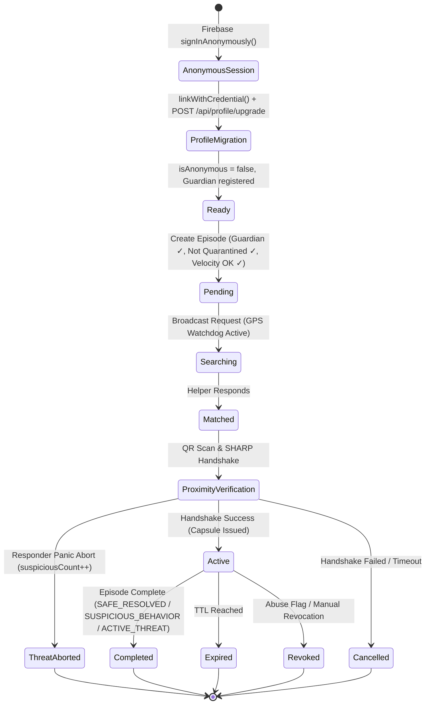
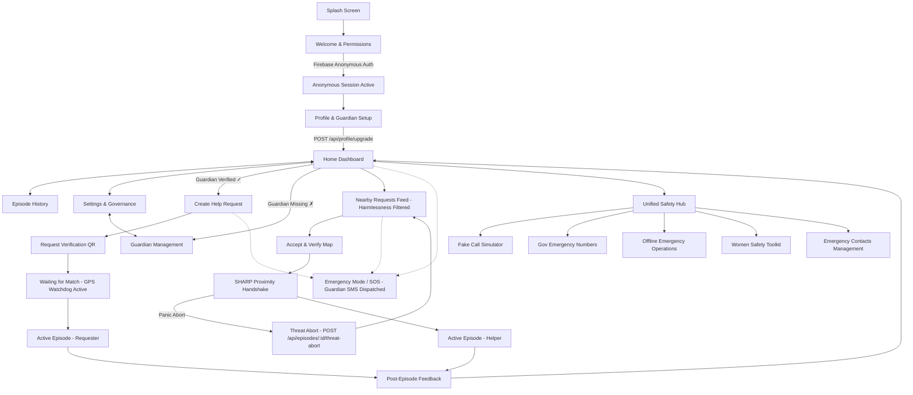

# Connify Master Technical Specification

## Table of Contents
- [Part 1: Project Overview & Analysis](#part-1-project-overview-analysis)
- [Part 2: System Architecture & Tech Stack](#part-2-system-architecture-tech-stack)
- [Part 3: User Flows & State Machines](#part-3-user-flows-state-machines)
- [Part 4: Navigation & Routing](#part-4-navigation-routing)
- [Part 5: Screen Inventory](#part-5-screen-inventory)
- [Part 6: Asset Inventory](#part-6-asset-inventory)
- [Part 7: Folder Structure](#part-7-folder-structure)
- [Part 8: Phases & Completion Status](#part-8-phases-completion-status)

---


# Part 1: Project Overview & Analysis

## 1.1 Project Overview
**Connify** is a decentralized, zero-trust proximity safety coordination protocol implemented as a mobile application. Rather than building a centralized identity directory or permanent reputation scores (which invite surveillance and compromise), Connify relies on **single-use trust relationships** established dynamically between two devices in physical proximity.

This is referred to as the **SHARP (Secure Proximity Handshake & Relayed Protocol)**:
* **Episode ID**: An ephemeral, UUIDv4 transactional identifier that isolates the transaction.
* **Trust Capsule**: A signed, time-bound, single-use JWT authorizing helper contact and ephemeral communications.
* **Environmental Signal Tag**: Client-side Bloom filters containing local environmental signals (Wi-Fi frame headers & LTE TC-RNTI control messages) to prevent location spoofing.
* **BCH Syndrome Key Exchange**: Error-correcting fuzzy extractors reconstruct session key $K$ from noisy proximity data.
* **Grid Index Blinding**: Fine-grained proximity verification using blinded grid cells, keeping exact locations oblivious to the server.

---

## 1.2 New Safety Systems (Implemented — v2.0)

The following safety systems have been fully built, tested, and verified with **27/27 integration tests passing (100%)**:

### 5-Pillar Harmlessness & Threat Assessment System
The backend calculates a real-time **Harmlessness Risk Score** before any distress episode is broadcast to nearby helpers:
1. **Trap & Velocity Detection**: Blocks devices triggering ≥ 3 episodes within a 10-minute window (predatory luring prevention).
2. **Dual-Sided Anonymity (SHARP Protocol)**: Responders receive only blinded proximity — never raw GPS or identity.
3. **Historical Resolution Ratio**: Tracks percentage of past episodes that ended in verified resolutions vs suspicious cancellations.
4. **Responder Panic Abort**: Responders can trigger `POST /api/episodes/:id/threat-abort` to flag suspicious senders.
5. **Automated Quarantine**: Accounts with ≥ 2 SUSPICIOUS_BEHAVIOR ratings are automatically quarantined (`isQuarantined: true`) and blocked from creating new episodes.

### 5-Second GPS Watchdog & Guardian SMS Alert System
* Every 5 seconds the device atomically **overwrites** its GPS record in MongoDB (`DeviceLocation` model).
* If no GPS ping is received for **15 seconds**, the `LocationWatchdogService` dispatches a personalized **Guardian SMS Alert** containing the user's full name, relationship, last known coordinates (read directly from MongoDB), and a live Google Maps link.
* If signal is regained (at any time — after power-off, Airplane mode, or extended blackout), a **Signal Recovered SMS** is dispatched immediately using the newly written DB coordinates.
* **Guardian registration is mandatory** — emergency episodes are blocked without a registered guardian on file.

### Anonymous → Registered Profile Migration (Firebase + MongoDB)
* Users launch Connify via **Firebase Anonymous Auth** (`signInAnonymously`).
* When onboarding is completed, the client calls `linkWithCredential(anonymousUser, credential)` to preserve the Firebase UID without creating a duplicate account.
* The backend exposes `POST /api/profile/upgrade` which atomically:
  - Marks `isAnonymous: false` in the `Profile` MongoDB document.
  - Binds `firebaseUid`, `firstName`, `lastName`, `phone`, `email` to the `deviceId`.
  - Creates or updates the mandatory `Guardian` record.
  - Writes audit log: `PROFILE_MIGRATED_FROM_ANONYMOUS`.

---

## 1.3 High-Level System Architecture



### Server-Side Layer
1. **API Gateway / Web Service (Fastify + TypeScript)**: Request routing, rate-limiting, and validation.
2. **Database (MongoDB Atlas + Mongoose)**: Stores `Device`, `Episode`, `Profile`, `Guardian`, `DeviceLocation`, `Outcome`, and `AuditLog` models.
3. **LocationWatchdogService**: 5-second atomic GPS pings, 15-second signal loss detection, unbounded signal recovery alerts, personalized Guardian SMS dispatch.
4. **BehavioralRiskEngine**: Real-time 5-pillar harmlessness scoring, trap velocity detection, auto-quarantine on suspicious behavior.
5. **ProfileController**: Anonymous-to-Registered migration with Firebase UID binding and mandatory guardian enforcement.

---

## 1.4 Threat Model & Security Controls

| Identified Threat | System Countermeasure / Control |
|---|---|
| **GPS Spoofing** | Proximity checks combine GPS with local Wi-Fi frames & LTE identifiers loaded into a Bloom filter. |
| **Replay Attacks** | Ed25519-signed 60-second challenge nonces, single-use replay defense tracked per device. |
| **Predatory Luring** | Velocity trap detection blocks ≥ 3 episodes in a 10-minute window per device. |
| **Signal Loss / Phone Off** | 15s watchdog dispatches Guardian SMS with last DB coordinates; unbounded recovery SMS on reconnect. |
| **No Guardian On File** | Episodes are strictly blocked if no guardian is registered; mandatory at `POST /api/profile/upgrade`. |
| **Surveillance Creep** | Outcome logging contains zero identities, location logs, or chat contents. Ephemeral channels auto-destruct on capsule expiry. |
| **Anonymous Impersonation** | Firebase `linkWithCredential()` preserves UID continuity; `PROFILE_MIGRATED_FROM_ANONYMOUS` audit log written. |
| **Private Key Exposure** | Device-bound Ed25519 signing keys stored in hardware-backed secure storage (iOS Keychain / Android Keystore). |

---

## 1.5 Codebase & Tooling Alignment

* **Frontend CLI**: React Native CLI (`0.86.0`) with TypeScript. Uses vanilla Stylesheets and Native modules.
* **Backend Runtime**: Node.js (`20+ LTS`) running Fastify (`5.10.0`) + TSX.
* **Database**: MongoDB Atlas (Mongoose ORM) — migrated from PostgreSQL/Prisma.
* **Auth**: Firebase Auth (Anonymous + Account Linking via `linkWithCredential`).
* **SMS Alerts**: Guardian SMS dispatched via `LocationWatchdogService` with personalized full name, relationship, and live Google Maps coordinates.
* **Deployment Platform**: Render hosting services (Web Service) configured in a single region.
* **Integration Test Coverage**: **27/27 tests passing (100%)** across 4 suites: Symmetric Verification Pipeline, 5-Pillar Harmlessness, Location Watchdog Guardian SMS, and Profile Migration.

---


# Part 2: System Architecture & Tech Stack

---

## 1. Architecture Philosophy

Connify is not just an app — it's a **protocol implemented as an app**. The architecture borrows directly from zero-trust identity patterns used in agentic AI systems (DIDs, Verifiable Credentials, Just-In-Time credentials, Zero-Knowledge Proofs) but simplifies them for human-to-human, consumer-grade use using the **SHARP protocol** for privacy-preserving proximity verification:

| Zero-Trust Agentic Concept | Connify Equivalent | SHARP Protocol Integration |
|---|---|---|
| Decentralized Identifier (DID) | **Episode ID** | Ephemeral request identifier (UUIDv4) that isolates transactional identity |
| Verifiable Credential (VC) | **Trust Capsule** | Ed25519-signed JWT authorizing single-use temporary contact |
| Just-In-Time (JIT) VC issuance | **JIT Capsule Issuance** | The Trust Capsule is minted only after the SHARP handshake succeeds |
| Zero-Knowledge Proof (selective disclosure) | **Selective Disclosure & Blinding** | Reveals urgency/category pre-match; Bob blinds his grid index $b$ using key $K$ |
| Agent Name Service (ANS) discovery | **Helper Match Engine** | Coarse-grained location filtering (PostGIS) to find nearby candidates |
| Global Session Authority + Revocation | **Episode Lifecycle Manager** | Redis-backed single-use checkouts and absolute timeouts |
| Audit logging by DID | **Outcome Logging Module** | Decoupled, identity-free logging of completion outcomes |
| **Proximity verification / Handshake** | **SHARP Verification Handshake** | Client-side environmental Bloom filters & BCH syndrome key reconstruction |

---

## 2. High-Level System Architecture

```
┌─────────────────────────────────────────────────────────────────┐
│                        CLIENT LAYER                              │
│   React Native / Expo (iOS & Android)  +  Next.js (Web Portal)   │
│   - Requester App View   - Helper App View   - Admin/Audit View  │
└───────────────┬───────────────────────────────┬─────────────────┘
                │  HTTPS/TLS + WebSocket (ephemeral channel)       │
┌───────────────▼───────────────────────────────▼─────────────────┐
│                     API GATEWAY / BFF LAYER                       │
│         Node.js (Express/Fastify) — request routing,             │
│         rate limiting, session token validation                  │
└───────────────┬───────────────────────────────┬─────────────────┘
                │                                │
┌───────────────▼──────────────┐   ┌─────────────▼─────────────────┐
│  LAYER 1: IDENTITY & EPISODE  │   │  LAYER 2: SHARP VERIFICATION   │
│  - Episode Creation Service   │   │  - Environmental Signal Tag    │
│  - Episode ID Registry        │   │  - Bloom Filter Generator      │
│  - Expiry & Lifecycle Manager │   │  - BCH Syndrome Key Exchange   │
│                                │   │  - Oblivious Proximity Handshake│
└───────────────┬───────────────┘   │  - Grid Index Blinding Module  │
                │                    └─────────────┬─────────────────┘
                │                                  │
┌───────────────▼──────────────────────────────────▼───────────────┐
│              LAYER 3: SELECTIVE DISCLOSURE ENGINE                 │
│   Determines minimum data helper needs to see (category, urgency, │
│   general location radius) — never full identity/address/history  │
└───────────────┬─────────────────────────────────────────────────┘
                │
┌───────────────▼───────────────┐
│      LAYER 4: TRUST CAPSULE SERVICE             │
│  - Validates Bob's blinded grid cell response  │
│  - Binds: 1 request + 1 helper + 1 time window  │
│  - Signs capsule (Ed25519 key pair)             │
│  - Enforces single-use + auto-expiry via Redis  │
└───────────────┬─────────────────────────────────┘
                │
┌───────────────▼──────────────────────┐   ┌──────────────────────────┐
│  LAYER 5: HELPER MATCH ENGINE         │   │ LAYER 6: EPHEMERAL COMMS │
│    based matching                     │   │    channel per episode   │
│  - Pushes match to nearby helpers     │   │  - Auto-destructs on     │
│                                        │   │    capsule expiry        │
└────────────────────────────────────────┘   └──────────────────────────┘
                │
┌───────────────▼─────────────────────────────────┐
│    LAYER 7: OUTCOME LOGGING (Minimal Audit)       │
│  Stores ONLY: success/fail, category, risk level, │
│  completed-within-window (yes/no) — no identity,  │
│  no location trail, no message content            │
└───────────────┬─────────────────────────────────┘
                │
┌───────────────▼─────────────────────────────────┐
│              DATA LAYER                           │
│  - Encrypted-at-rest DB (episode metadata only)   │
│  - Ephemeral key-value store (active capsules)    │
│  - No persistent identity graph / no full profiles│
└───────────────────────────────────────────────────┘
```

---

## 3. Core Services (Backend)

| Service | Responsibility | Notes |
|---|---|---|
| **Episode Service** | Creates/tracks help-request lifecycle | Each episode = one DID-like unique ID |
| **Verification Service** | Executes the SHARP handshake. | Manages environmental Bloom filters & BCH syndromes, and verifies Bob's blinded grid cell response |
| **Disclosure Service** | Filters data shown to helper | Rule-based, could evolve to ZKP-based proofs |
| **Trust Capsule Service** | Issues, signs, expires tokens | JIT-issuance — only after SHARP verification passes |
| **Matching Service** | Finds nearby candidate helpers | Coarse location filtering using PostGIS radius checks |
| **Comms Relay** | Ephemeral messaging/calling | Channel dies when capsule expires |
| **Outcome Service** | Minimal feedback logging | Decoupled from identity — privacy by design |
| **Revocation/Expiry Worker** | Kills capsules/sessions on timeout or abuse flag | Equivalent to "global logout" pattern |

---

## 4. Threat Mitigation Mapped to Architecture

| Threat | Architectural Control |
|---|---|
| Fake requests | SHARP Verification Service (Environmental location tags containing entropy > 64 bits to prevent forgery) |
| Spoofed location | Multi-signal environmental tags (Wi-Fi frame headers & LTE control messages like TC-RNTI), preventing GPS spoofing apps |
| Malicious helpers | Identity exposure delayed until capsule issuance |
| Replay attacks | Capsule bound to 1 request/1 helper/1 time window and single-use Redis NX lock |
| Surveillance creep | Outcome Service stores minimal, non-identifying data only |


---

## 5. App Pages & Features

### A. Onboarding & Access
**Page: Welcome / Get Started**
- Minimal sign-up (phone number or device-bound key, no heavy KYC)
- Brief protocol explainer ("one-time trust, not a profile")
- Permission requests: location, camera (QR), notifications

**Page: Home Dashboard**
- Toggle: "I need help" vs "I can help nearby"
- Active episode status card (if any)
- Quick-access emergency mode button

---

### B. Requester Flow

**Page: Create Help Request**
- Category selector (medical, transport, general, emergency)
- Urgency slider
- Short context field (auto-limited to prevent oversharing)
- Coarse location capture (approximate grid cell, not exact coordinates)

**Page: Request Verification**
- Generates time-bound QR code containing Alice's location tag syndromes (BCH) and helper string $y$
- Shows device-consistency status
- Optional "add a witness" (nearby trusted contact confirms)

**Page: Waiting for Match**
- Live status: searching → matched → capsule issued
- Cancel button (kills episode instantly)

**Page: Active Episode (Requester View)**
- Ephemeral chat/call with matched helper
- Countdown timer to capsule expiry
- "Mark complete" / "Report issue" buttons

**Page: Feedback**
- Binary success/failure
- Category confirmation
- No free-text personal commentary stored beyond this

---

### C. Helper Flow

**Page: Nearby Requests Feed**
- List of anonymized, disclosure-filtered requests (category + urgency + rough distance only)
- No requester identity shown pre-match

**Page: Accept & Verify**
- Scans requester's QR
- Captures nearby Wi-Fi frame headers and LTE control messages (TC-RNTI) to construct local location tag Bloom filter
- Reconstructs session key $K$ via BCH syndrome decoding, and submits blinded grid cell index $B = \mathcal{H}'(K, b \mathbin{\Vert} \text{"Bob"})$
- Trust Capsule issued only after verification checks pass

**Page: Active Episode (Helper View)**
- Reveals only the minimum info needed to complete the task
- Ephemeral comms channel
- Capsule countdown visible

**Page: Completion & Feedback**
- Confirms task outcome
- Capsule auto-invalidates, channel closes


---

### D. Trust & Safety Layer (Shared)

**Page: Emergency / High-Stakes Mode**
- Streamlined flow for scenarios like the oxygen-concentrator blackout case
- Priority matching + faster verification thresholds
- Optional auto-alert to local emergency services

**Page: Episode History (Minimal)**
- Shows only past episode outcomes (success/fail, category) — never full chat logs or helper/requester identities
- No persistent reputation score exposed to other users (avoids surveillance-style profiling)

---

### E. Settings & Governance

**Page: Privacy & Data**
- Explains exactly what's logged (outcome data only)
- Data deletion / episode purge controls

**Page: Device & Security**
- Manage device-bound keys
- Witness contact management

**Page: About the Protocol**
- Explains episode-bound trust model to build user understanding/trust

---

## 6. Phased Build Alignment

| Phase | Architecture Focus | App Pages Enabled |
|---|---|---|
| **Phase 1** | Episode Service, basic SHARP handshake (Wi-Fi frame header tags, manual QR check) | Create Request, Verification, Waiting for Match, Active Episode (basic) |
| **Phase 2** | Device-bound checks, LTE control signals, BCH syndrome coding, automatic proximity check | Enhanced Verification, countdown timers |
| **Phase 3** | Selective Disclosure Engine, grid cell blinding, PostGIS coarse matching | Nearby Requests Feed filtering, Emergency Mode |
| **Phase 4** | Privacy refinement, outcome-based matching tuning | Episode History, Privacy & Data settings |


---

## 7. Detailed Tech Stack

A note on feasibility first: the original proposal language (DIDs, Verifiable Credentials, ZKPs) is useful as a **conceptual model**, but a real blockchain-based DID/VC stack is unnecessary overhead for a consumer safety app and would add latency, cost, and complexity with no real benefit at MVP scale. Below is what's actually buildable, with the "protocol" ideas implemented as **plain signed tokens and server-side rules** rather than DLT infrastructure. A path to true DID/ZKP is noted at the end for later phases, if ever justified.

### 7.1 Mobile Client (React Native + Expo)
The mobile client is built as a native application using **React Native and the Expo SDK**, targeting iOS and Android. This provides native performance, native UI rendering (rather than WebViews), and seamless access to hardware security modules like Keychain/Keystore.

| Component | Technology | Why |
|---|---|---|
| Mobile Framework | **React Native (Expo)** | Cross-platform native application framework for iOS and Android |
| State Management | **Zustand** | Minimal boilerplate, lightweight state management that scales easily |
| UI/Styling | **NativeWind** or **StyleSheet** | Tailored UI styles; NativeWind allows Tailwind-like syntax in React Native |
| QR Code Generation | `react-native-qrcode-svg` | Renders vector QR codes quickly in React Native |
| QR Code Scanning | `expo-camera` | High-accuracy native camera access for fast, reliable QR verification |
| Geolocation | `expo-location` | Queries high-precision device GPS, falls back to cell/Wi-Fi positioning |
| Push Notifications | `expo-notifications` | Interfaces with iOS APNs and Android FCM via EAS |
| Secure Storage (Sensitive) | `expo-secure-store` | Accesses iOS Keychain and Android Keystore for Ed25519 signing keys and device fingerprints |
| Local Storage (Non-sensitive)| `@react-native-async-storage/async-storage` | Simple, persistent key-value store for app settings/caching |
| Real-time Comms | `socket.io-client` | Standard WebSockets client to communicate with Fastify Socket.IO server |


### 7.2 Frontend (Web — Admin/Audit Portal)
| Component | Technology | Why |
|---|---|---|
| Framework | **Next.js 14+ (App Router)** | SSR for admin dashboards, good DX |
| UI | **Tailwind CSS + shadcn/ui** | Fast, accessible components |
| Charts (audit/ops dashboards) | **Recharts** | Lightweight, sufficient for ops metrics |

### 7.3 Backend / API
| Component | Technology | Why |
|---|---|---|
| Runtime | **Node.js 20 LTS** | Matches team's stack, mature ecosystem |
| API framework | **Fastify** (preferred over Express for this) | Built-in schema validation, better throughput for real-time-heavy app |
| Language | **TypeScript** | Type safety across episode/capsule state machines — important given the correctness requirements (single-use, expiry) |
| API contract | **OpenAPI 3 + Zod schemas** | Enforced request/response validation |
| Background jobs | **BullMQ (Redis-backed)** | Capsule expiry sweeps, revocation propagation, match timeouts |
| Real-time layer | **Socket.IO (server)** with Redis adapter | Handles ephemeral chat rooms scoped per episode; Redis adapter needed once you run >1 server instance |

### 7.4 Data Layer
| Component | Technology | Why |
|---|---|---|
| Primary DB | **MongoDB Atlas** | Document flexibility and `2dsphere` indexes for geospatial queries (see §7.6, §8.1) |
| ODM | **Mongoose** | Schema validation, type-safe queries, and rich middleware support |
| Ephemeral/session store | **Render Key Value** (Redis-compatible, Valkey 8) | Active capsules, rate limits, Socket.IO pub/sub, BullMQ queues — same region as the API service to keep latency low |
| Encryption at rest | **MongoDB Atlas built-in encryption** | Minimizes blast radius if DB is breached |
| Data retention | Render **Cron Job** purges episode/location data post-expiry; only outcome summary rows persist long-term | Matches the "minimal outcome logging" design goal |

### 7.5 Identity, Verification & "Trust Capsule" Cryptography
This replaces the DID/VC/DLT framing with a realistic, auditable equivalent based on the **SHARP protocol** for secure, private proximity verification:

| Concept | Real Implementation |
|---|---|
| Episode ID (~"DID") | UUIDv4 generated server-side per request, never reused |
| Trust Capsule (~"VC") | **JWT signed with Ed25519** (via `jose` or `paseto` library) — short expiry (`exp` claim), single-use enforced via Redis key that's deleted on first validation |
| Device consistency check | Device fingerprint (hashed hardware/install ID) stored per episode, compared on capsule redemption |
| QR token / Syndromes | Short-lived QR containing **BCH syndromes** of Alice's location tag Bloom filter and a helper string $y$. |
| Wi-Fi/LTE Location Tag | Built client-side by capturing environmental signals (Wi-Fi frame headers and LTE control messages like TC-RNTI) and loading them into a 1024-bit Bloom filter. |
| Fuzzy Extractor Handshake | Bob reconstructs the temporary session key $K$ by applying BCH syndrome decoding to his own location tag Bloom filter. |
| Fine-Grained Grid Check | Bob sends a blinded grid index $B = \mathcal{H}'(K, b \mathbin{\Vert} \text{"Bob"})$. Alice searches her nearby grid cells to find a match, verifying Bob's proximity without revealing exact location to the server. |
| Signing keys | **Ed25519 key pair per server environment**, stored in a secrets manager (AWS KMS / GCP Secret Manager), rotated periodically |
| Selective disclosure | Server-side filtering + grid blinding — only coarse region shown pre-match, exact proximity verified privately by Alice. |

> **Why not real ZKPs/DIDs at MVP:** They require either a permissioned ledger (ops overhead, no real decentralization benefit for a single-company app) or heavy client-side crypto libraries that hurt mobile performance and add UX friction (key backup/recovery becomes a support nightmare). The SHARP protocol's combination of Bloom filters, BCH syndromes, and grid cell blinding achieves strong location privacy (oblivious server) and unforgeable proximity checks with minimal mobile computational overhead.


### 7.6 Infrastructure & Hosting — Render

Verified against Render's current documentation (not assumed) — the mapping below uses Render's actual service types:

| Component | Render Service | Why / Verified Detail |
|---|---|---|
| API server (Fastify/Node) | **Web Service** | Git-push deploy, auto TLS on custom domains, autoscaling on paid plans. Web Services support inbound WebSocket connections natively — confirmed no enforced max connection duration (Render recommends ping/pong keepalive, since instances can still restart on deploys/maintenance) |
| Real-time chat (Socket.IO) | Same **Web Service**, or a dedicated one | Runs on the same long-lived instance model — this is exactly the persistent-connection use case Render is built for, unlike serverless platforms where WebSockets are tied to function lifecycles |
| Primary database | **MongoDB Atlas** | Utilizes `2dsphere` indexes for geospatial queries in §8.1. Integrated with Render services securely. |
| Redis / session store | **Render Key Value** | Redis-compatible (runs Valkey 8 on new instances — a drop-in-compatible fork, works fine with `ioredis`/`bullmq`); used for capsule single-use locks, rate limiting, Socket.IO pub/sub adapter |
| Background jobs (BullMQ workers) | **Background Worker** | Purpose-built for exactly this: continuously polling a Redis-backed queue with no HTTP interface — matches the capsule-expiry sweep and revocation-propagation jobs described in §3 |
| Scheduled purge job (data retention, §8.1) | **Cron Job** | Render cron jobs support runs up to 12 hours — comfortably enough for a nightly retention/purge task |
| Admin/audit web portal (Next.js) | **Static Site** (if exported statically) or **Web Service** (if you need SSR) | Static Site gives you Render's CDN for free; only use a Web Service here if the admin portal needs server-side rendering |
| Secrets (signing keys, DB credentials) | **Render Environment Variables (marked secret) / Secret Files** | Render doesn't offer an AWS KMS/HSM equivalent — for the Ed25519 signing key, store it as a secret environment variable or Secret File, generated once at provisioning time and rotated manually. If true hardware-backed key custody becomes a compliance requirement later, that would need an external KMS (e.g., AWS KMS) called from the Render service, not something Render itself provides |
| Logs/metrics | Render's built-in log stream + metrics dashboard, **plus Sentry** for error tracking | Render's native tooling covers basic ops visibility; Sentry is still worth adding for structured error tracking/alerting, since that's outside Render's built-in scope |
| CI | **GitHub Actions** for tests/linting before merge, Render's native Git auto-deploy for the actual deploy step | Render deploys directly from a connected GitHub repo — you don't need a separate deploy pipeline, just gate merges with CI checks |

**Practical constraints worth knowing before committing to Render:**
- **Region selection matters more than usual:** Render's regions are limited (e.g., Oregon, Ohio, Virginia, Frankfurt, Singapore). Your Web Service, MongoDB Atlas cluster, and Key Value instance should all be provisioned in the **same region** — cross-region hops add latency to every DB/Redis call, which matters here since capsule verification is latency-sensitive (users are standing there waiting for a QR scan to resolve).
- **Multi-instance WebSockets:** if you ever autoscale the API to multiple instances, a client is **not guaranteed to reconnect to the same instance** after a disruption — this is exactly why the Redis adapter for Socket.IO (already specified in §7.3) is not optional once you scale past one instance.
- **No built-in HSM:** if a future compliance requirement (e.g., partnering with a government/NGO body per §7.8) demands hardware-backed key custody, Render alone won't satisfy that — you'd bolt on an external KMS at that point, not before.


### 7.7 Security Hardening Specifics
- **Rate limiting:** `@fastify/rate-limit` backed by Redis — prevents QR/capsule brute-forcing.
- **TLS everywhere:** enforced via load balancer; no plaintext transport ever.
- **Audit log signing:** each outcome log entry hashed (SHA-256) and chained to the previous entry's hash (simple hash-chain, not a blockchain) so tampering is detectable without DLT overhead.
- **Abuse/kill-switch:** Redis flag per episode ID checked by the Socket.IO gateway on every message — equivalent to the "global session revocation" pattern, without needing a distributed session authority.

### 7.8 Realistic Later-Phase Options (not MVP)
If Connify scales into a multi-organization or cross-platform protocol (e.g., licensed to NGOs, cities, other apps), *then* real DIDs/VCs become justified:
- `did:web` (simplest, no ledger required) issued per organizational partner, not per user
- W3C Verifiable Credentials for cross-org trust (e.g., a city emergency service verifying a partner app's episodes)
- This should only be pursued once there's a genuine multi-party trust boundary — not for a single-vendor consumer app.

---

## 8. Database Architecture (Detailed)

Database choice is **backend-agnostic to how you built the frontend** — MongoDB/Redis work the same whether the client is React Native/Expo, a plain web app, or a Capacitor-wrapped app. Since you've settled on **Render** for hosting (§7.6), the server-side layer below is specifically **MongoDB Atlas** and **Render Key Value**. What *does* change because of the React Native approach is the **client-side local storage layer**, covered in §8.2.

### 8.1 Server-Side Database (Source of Truth)

**MongoDB Atlas** serves as the primary store. The state machine transitions (episode → capsule → outcome) are managed through Mongoose application-level validations. Geospatial queries utilize MongoDB's `2dsphere` indexes, avoiding the need for complex PostGIS setup.

**Core schema (simplified Mongoose definitions):**

```typescript
// ── Device Model ──────────────────────────────────────────────────────
const DeviceSchema = new Schema({
  deviceFingerprintHash: { type: String, required: true, unique: true },
  publicKey: { type: String, required: true },
  isQuarantined: { type: Boolean, default: false },
  suspiciousCount: { type: Number, default: 0 },
  harmlessnessScore: { type: Number, default: 100 },
  createdAt: { type: Date, default: Date.now },
});

// ── Episode Model ─────────────────────────────────────────────────────
const EpisodeSchema = new Schema({
  requesterDeviceId: { type: Schema.Types.ObjectId, ref: 'Device', required: true },
  category: { type: String, required: true },
  urgency: { type: Number, required: true },
  status: { type: String, default: 'pending' },
  latitude: { type: Number, required: true },
  longitude: { type: Number, required: true },
  location: {
    type: { type: String, enum: ['Point'], default: 'Point' },
    coordinates: { type: [Number], required: false }, // [longitude, latitude]
  },
  radiusMeters: { type: Number, default: 500 },
  createdAt: { type: Date, default: Date.now },
  expiresAt: { type: Date, required: true },
});
EpisodeSchema.index({ location: '2dsphere' });

// ── Capsule Model ─────────────────────────────────────────────────────
const CapsuleSchema = new Schema({
  episodeId: { type: Schema.Types.ObjectId, ref: 'Episode', required: true },
  helperDeviceId: { type: Schema.Types.ObjectId, ref: 'Device', required: true },
  signedTokenHash: { type: String, required: true },
  status: { type: String, default: 'issued' }, // issued/redeemed/expired/revoked
  issuedAt: { type: Date, default: Date.now },
  expiresAt: { type: Date, required: true },
});

// ── Outcome Model ─────────────────────────────────────────────────────
const OutcomeSchema = new Schema({
  episodeId: { type: Schema.Types.ObjectId, ref: 'Episode', required: true },
  result: { type: String, required: true }, // success/failure
  category: { type: String, required: true },
  completedInWindow: { type: Boolean, required: true },
  createdAt: { type: Date, default: Date.now },
});

// ── AuditLog Model ────────────────────────────────────────────────────
const AuditLogSchema = new Schema({
  eventType: { type: String, required: true },
  episodeId: { type: Schema.Types.ObjectId, ref: 'Episode' },
  prevHash: { type: String, required: true },
  entryHash: { type: String, required: true },
  createdAt: { type: Date, default: Date.now },
});
```

**Key technical decisions:**
| Decision | Reasoning |
|---|---|
| `location: { type: 'Point', coordinates: [...] }` | Initial coarse filtering uses MongoDB's `$near` and `$geoWithin` operators over a `2dsphere` index to broadcast matching notifications — exact proximity is subsequently validated privately via SHARP. |
| Spatial index | `EpisodeSchema.index({ location: '2dsphere' });` — required for MongoDB radius queries to stay fast as episode volume grows |
| BCH Syndromes & Helper String y | Stored in `episodes` document to allow matched helpers to perform local fuzzy extractor reconstruction of the session key $K$. |
| ObjectIds and Refs | Ensures efficient JOIN-like populated queries, although the state machine is enforced in the `EpisodeController`. |
| `signed_token_hash` not the token | Even if the DB is breached, the actual bearer token (JWT) can't be extracted and replayed |

**Ephemeral/session store — Render Key Value (Redis-compatible):**
- Active capsule single-use lock: `SET capsule:{id} used NX EX {ttl}` — atomic, so two simultaneous redemption attempts can't both succeed (solves the double-spend problem for a single-use token). This works identically on Render Key Value since it's Redis-protocol-compatible (Valkey 8 under the hood on new instances)
- Rate limiting counters (per device, per IP)
- Socket.IO pub/sub adapter + BullMQ job queues (expiry sweeps, match timeouts) — run the BullMQ consumers as a Render **Background Worker**, not inside the Web Service, so a queue backlog can't starve incoming HTTP/WebSocket traffic

**Retention/purge job:**
A scheduled worker (BullMQ cron job) deletes `episodes.coarse_location` and any transient verification data once `status = completed/expired`, retaining only the `outcomes` row long-term. This operationalizes the "minimal outcome logging" principle rather than just stating it as a policy.


---

### 8.2 Client-Side Local Storage (React Native / Expo App)

This is the part that changes because of your build approach. A React Native app runs your JavaScript code directly, rendering native UI components instead of running inside a native WebView. That means standard browser storage APIs like `localStorage` or `IndexedDB` are unavailable. Instead, we use native storage wrappers. Crucially, sensitive keys must use hardware-backed secure storage, as storing signing keys in plain text is a real security gap.

| Storage need | Correct choice | Why |
|---|---|---|
| UI state, draft form data, filter preferences | `@react-native-async-storage/async-storage` | Non-sensitive, fine to lose on app reinstall |
| Cached read-only data (episode history list for offline viewing) | `expo-sqlite` or a SQLite wrapper | Structured, queryable, works offline for **read-only** display |
| Device key pair (Ed25519 private key) | `expo-secure-store` | **Never** use plaintext `AsyncStorage` — private keys must be stored in iOS Keychain or Android Keystore, which are hardware-backed and secure against basic system compromise |
| Device fingerprint / verification token | `expo-secure-store` | It's presented during capsule redemption — if it leaks, an attacker can impersonate the device in the verification handshake |

**Why this matters concretely for Connify:** the "device consistency check" in the Threat Model (§4) is only meaningful if the key it relies on can't be trivially copied off the device. If that key sits in unencrypted local storage, it is extractable with basic tooling on a compromised or rooted device. Keystore/Keychain-backed storage requires hardware-level compromise or device unlock clearance to extract, which is the security guarantee the architecture is claiming to provide.

**No offline path for capsule issuance/redemption — by design, not limitation:**
Single-use enforcement (§8.1, Redis `SET NX`) requires a server round-trip as the single source of truth. If capsule validation were done client-side against locally cached state, two devices could each independently "validate" the same capsule while both offline, and both proceed — a classic double-spend problem. So: cache read-only data offline freely; never let the verification/capsule flow degrade to an offline mode.

---

### 8.3 React Native + Expo Build Pipeline (EAS) — Practical Notes

Since you are using a native development environment with Expo:

1. **Development & Testing:** Use Expo Go for rapid prototyping during local development, or build a custom development client (`npx expo run:android` / `npx expo run:ios`) when native configuration changes are required.
2. **EAS Build & Update:** Leverage Expo Application Services (EAS) for cloud builds (`eas build`) and Over-The-Air (OTA) updates (`eas update`), avoiding the need to configure complex Xcode and Android Studio environments locally.
3. **Credentials Management:** Firebase configuration (`google-services.json` for Android and `GoogleService-Info.plist` for iOS) should be referenced in `app.json` under `expo.android.googleServicesFile` and `expo.ios.googleServicesFile` so Expo handles compilation automatically.
4. **Permissions Configuration:** System permissions (camera, location, notifications) are specified in the `app.json` / `app.config.js` plugins array (e.g., `expo-camera`, `expo-location`). Expo Config Plugins generate the correct native configuration files during the prebuild phase.
5. **Background execution & Socket lifecycle:** React Native JS threads are suspended by the OS when the app is backgrounded. Socket.IO connections will drop. Always use native APNs/FCM push notifications (`expo-notifications`) as the primary wake-up and alert channel, and reconnect/sync socket state when the app regains focus using standard React Native `AppState` listeners.
6. **Metro Bundler configuration:** Metro serves JS bundles to React Native. Ensure configuration in `metro.config.js` supports resolving standard npm dependencies.

---

*This document synthesizes the Connify proposal architecture with zero-trust identity patterns (episode-as-identity, capsule-as-credential, JIT issuance, selective disclosure) adapted for a consumer safety context rather than a multi-agent AI system, and reflects a React Native + Expo mobile application for iOS and Android deployment.*

---

## Tech Stack

### Web Portal (Frontend)
- Next.js (App Router)
- Tailwind CSS + shadcn/ui
- Recharts

### Mobile Client (React Native)
- React Native and Expo SDK
- Zustand (State Management)
- expo-camera (QR Code Scanning)
- expo-location (Geolocation)
- expo-notifications (Push Notifications)
- expo-secure-store (Hardware-backed Secure Storage)
- @react-native-async-storage/async-storage (Local Storage)
- socket.io-client (Real-time Comms)

### Backend and APIs
- Node.js with Fastify and TypeScript
- OpenAPI 3 and Zod
- Socket.IO client/server
- BullMQ

### Data and Storage
- MongoDB Atlas with Mongoose
- Redis-compatible Key Value store
- MongoDB built-in encryption

### Security and Infrastructure
- JWT signed with Ed25519
- Rate limiting, TLS, and secure storage for device keys
- Render Web Service, MongoDB Atlas, Render Key Value, Background Worker, and Cron Job

---

## Developers

| Team Member | Primary Role | Responsibilities |
|---|---|---|
| **Godfrey T R** | Lead Software Engineer & System Architect | Design the overall protocol architecture, backend services, trust capsule lifecycle, API contracts, security architecture, authentication flow, system integration, deployment strategy, and overall engineering decisions. Coordinate implementation across modules. |
| **Hari Prakash A** | Frontend Engineer, UX/UI & Product Experience Lead | Design the user journey, React Native/Expo frontend, prototype screens, trust flow visualization, selective disclosure interface, QR interaction experience, branding, presentation assets, and usability improvements. |
| **Grish Narayanan S** | AI, Security & Verification Systems Engineer | Design and implement the Need Verification Engine, contextual verification logic, trust scoring experiments, AI-assisted fraud detection, device consistency validation, Wi-Fi/GPS verification pipeline, cryptographic token validation, and future intelligent matching algorithms. |

---


# Part 3: User Flows & State Machines

This document details the step-by-step user interactions and state transitions for the core Connify workflows, updated to reflect the v2.0 safety systems.

---

## 5.0 Pre-Session: Anonymous → Registered Profile Migration (NEW v2.0)

```
[App Launch] ➔ [Firebase Anonymous Auth] ➔ [Ed25519 Key Generation] ➔ [Profile Setup] ➔ [Guardian Registration] ➔ [linkWithCredential()] ➔ [POST /api/profile/upgrade] ➔ [Session Active]
```

1. **Launch**: App launches — Firebase `signInAnonymously()` is called silently. An anonymous `firebaseUid` is assigned.
2. **Key Generation**: Device generates an Ed25519 key pair. Public key is registered with the backend (`POST /api/devices/register`). Private key is stored in hardware-backed secure storage (iOS Keychain / Android Keystore).
3. **Profile Onboarding**: User fills in `firstName`, `lastName`, `phone`, and `email`.
4. **Guardian Registration (Mandatory)**: User must provide guardian `fullName`, `phone`, and `relationship`. This is enforced — no episodes can be created without it.
5. **Account Linking**: Client calls Firebase `linkWithCredential(anonymousUser, emailOrPhoneCredential)`. The anonymous UID is preserved — no duplicate account is created.
6. **Backend Upgrade**: Client calls `POST /api/profile/upgrade` with `firebaseUid`, profile data, and guardian data.
   - MongoDB `Profile` document: `isAnonymous` set to `false`.
   - MongoDB `Guardian` document: created and bound to `deviceId`.
   - Audit log written: `PROFILE_MIGRATED_FROM_ANONYMOUS`.
7. **Ready**: User proceeds to the Home Dashboard with full episode creation privileges.

---

## 5.1 Requester Journey

```
[Create Request] ➔ [Backend Validates: Guardian ✓, Not Quarantined ✓, Velocity OK ✓] ➔ [Select Urgency] ➔ [Coarse Location] ➔ [GPS Watchdog Active] ➔ [Generate QR] ➔ [Wait for Match] ➔ [Active Help Stack] ➔ [Submit Feedback & Purge]
```

1. **Initiation**: Alice opens the app to the **Dashboard** and presses **I NEED HELP**.
2. **Backend Pre-Checks** (5-Pillar Harmlessness Engine):
   - Verifies at least 1 guardian is registered (`Guardian.find({ deviceId })`).
   - Checks device is not quarantined (`isQuarantined: false`).
   - Checks velocity trap limit: < 3 episodes created in the last 10 minutes.
3. **Category Selection**: Selects medical, security, transport, or other emergency category.
4. **Urgency Metric**: Adjusts the scale slider (1 to 5) indicating danger level.
5. **General Location**: Device captures approximate location coordinates (coarse grid, not exact).
6. **GPS Watchdog Starts**: Client begins sending `POST /api/locations/ping` every 5 seconds with fresh GPS coordinates. MongoDB atomically overwrites the previous location record.
7. **Syndrome Verification QR**: System generates a QR containing Alice's location tag syndromes (BCH syndromes) and helper string $y$.
8. **Broadcasting**: Alice submits and enters the **Searching for Help** state.
9. **Signal Loss Guard**: If GPS ping is not received for ≥ 15 seconds (phone powered off, Airplane mode, signal blackout):
   - Backend `LocationWatchdogService` dispatches a **personalized Guardian SMS** with the guardian's name, relationship, Alice's full name, last known MongoDB coordinates, and a live Google Maps link.
   - On reconnect: a **Signal Recovered SMS** is dispatched immediately with fresh coordinates.
10. **Connection**: Once matched, the server initializes an ephemeral WebSocket channel. Alice's device verifies Bob's blinded grid cell response.
11. **Trust Capsule**: A JIT-issued Trust Capsule is minted and signed (Ed25519 JWT).
12. **Active Assistance**: Alice chats or calls Bob over the secure, time-bound connection.
13. **Resolution**: Alice clicks **Complete Episode**. The system opens the **Feedback Screen**, purges local session caches, and stores outcome status.

---

## 5.2 Helper Journey

```
[Active Helper Feed - Harmlessness Filtered] ➔ [Anonymized Request] ➔ [Scan QR Proximity] ➔ [Verify local signals] ➔ [Optional: Panic Abort] ➔ [Decrypt session key K] ➔ [Redeem Capsule] ➔ [Active Comms] ➔ [Feedback & Purge]
```

1. **Activation**: Bob opens the app, navigates to the dashboard, and toggles **I CAN HELP**.
2. **Feed Review**: Views anonymized proximity list. **Requests from quarantined or velocity-flagged senders are hidden by the `BehavioralRiskEngine`.** Each card displays rough distance (e.g. `~400m away`), urgency tier, and category.
3. **Acceptance**: Bob hits **Respond Now** and views navigation directions.
4. **Meeting & Proximity Handshake**: Bob arrives and scans Alice's QR.
5. **SHARP Verification**:
   * Bob's app captures local Wi-Fi beacon frame headers and LTE TC-RNTI messages, converting them to a local Bloom filter.
   * Applying BCH syndrome error correction (from Alice's QR), the app decrypts the temporary session key $K$.
   * Bob's app computes blinded grid index $B = \mathcal{H}'(K, b \mathbin{\Vert} \text{"Bob"})$ and submits it.
6. **Responder Panic Abort (NEW v2.0)**: If Bob detects suspicious or threatening behavior at the scene:
   * Bob taps **REPORT THREAT** → calls `POST /api/episodes/:id/threat-abort`.
   * Alice's device `suspiciousCount` is incremented. If ≥ 2, her account is automatically quarantined (`isQuarantined: true`).
   * Episode is flagged as `SUSPICIOUS_BEHAVIOR` and closed immediately.
7. **Capsule Issuance**: Server validates response against Alice's record. If verified, issues Bob a short-lived Trust Capsule (Ed25519 JWT) stored in `@react-native-async-storage/async-storage` (metadata) and `expo-secure-store` (signing keys/tokens).
8. **Active Assistance**: Bob's app enables direct communication channels (ephemeral chat and call).
9. **Completion**: Bob triggers **Complete Episode** and submits `SAFE_RESOLVED`, `SUSPICIOUS_BEHAVIOR`, or `ACTIVE_THREAT` as the outcome. Token invalidated, channels purged.

---

## 5.3 Emergency Override Flow (SOS Trigger)

```
[SOS Press] ➔ [Immediate Broadcast] ➔ [Guardian SMS Dispatched with DB Location] ➔ [Emergency Dispatch Alert] ➔ [Log Out-of-band Token]
```

1. **Trigger**: User presses and holds the **SOS** button on any screen for 3 seconds.
2. **Override**: Bypasses normal verification queues, immediately broadcasting location coordinates to all verified helpers within a 2km radius.
3. **Guardian SMS (NEW v2.0)**: Guardian SMS is dispatched immediately with the last GPS coordinates stored in MongoDB and a live Google Maps link.
4. **Dispatch**: (Optional) Sends out an automated notification hook to municipal emergency dispatch services.
5. **Logging**: Outcome Logging stores a high-risk category indicator.

---

## 5.4 GPS Watchdog & Signal Recovery Flow (NEW v2.0)

```
[Active Session] ➔ [5s GPS Ping → MongoDB Atomic Overwrite] ➔ [Signal Lost ≥ 15s] ➔ [Guardian SMS with DB Coordinates] ➔ [Signal Regained] ➔ [Recovery SMS with New DB Coordinates]
```

1. Every 5 seconds, device sends `POST /api/locations/ping` with fresh `latitude`, `longitude`, `accuracy`.
2. MongoDB `DeviceLocation` record is atomically overwritten (previous record deleted upon new data received).
3. If no ping received for ≥ 15 seconds (`signalLostAlertSent: false`, `lastPingAt < cutoff`):
   * `LocationWatchdogService.checkSignalLossAndNotifyGuardians()` fires.
   * Guardian SMS dispatched: reads coordinates directly from MongoDB (never hardcoded). Contains user's full name, guardian's relationship, last known GPS coordinates, and a live Google Maps link.
   * `retryCount` incremented. No limit on retries.
4. When signal returns (any time — 15 seconds, 1 hour, or after power-off):
   * Fresh GPS ping arrives → MongoDB updated.
   * **Signal Recovered SMS** dispatched immediately with new coordinates from MongoDB.

---

## 5.5 Unified Safety Hub Utilities Flow (NEW v2.0)

```
[Dashboard] ➔ [Safety Hub] ➔ [Select Tool: Fake Call / Offline Mode / Women Safety] ➔ [Execute Utility]
```

1. **Access**: User navigates to the Unified Safety Hub from the main dashboard.
2. **Emergency Contacts Management**: User can dynamically add or remove trusted secondary contacts.
3. **Fake Call Simulator**: User configures caller ID and sets a timer (e.g., 5s, 30s). An incoming call simulation is triggered to deter harassment.
4. **Offline Emergency Mode**: If cellular data is lost, user can execute direct SMS dispatch to pre-configured guardians and initialize local Bluetooth LE broadcasts.
5. **Women Safety Toolkit**: specialized sub-tools for discreet SOS triggering without visual/audio indicators.

---

## 5.6 State Machine Transition Map (Updated v2.0)



---


# Part 4: Navigation & Routing

This document defines the routing configuration, view hierarchy, and navigation flow of the Connify Mobile application.

## 4.1 Mobile Navigation Tree

The application is structured into four primary navigation paths: **Onboarding & Profile Migration stack**, **Main application tabs**, **Transactional workflow overlays** (Requester stack and Helper stack), and the **Guardian Management modal**.



---

## 4.2 Route Definitions (React Navigation)

The mobile client leverages `@react-navigation/native-stack` for workflows and `@react-navigation/bottom-tabs` for the main dashboard view structure.

### 4.2.1 Auth / Onboarding Stack (No Session)
* `Splash`: Initializes Firebase Anonymous Auth silently. Generates Ed25519 key pair stored in hardware-backed secure storage (Keychain / Keystore).
* `Welcome`: Guidelines, protocol explanations, and system permissions (Location, Notifications, Camera).
* `HomeSetup`: **[NEW v2.0]** — Profile & Guardian Registration. Calls `POST /api/profile/upgrade`. Upgrade is mandatory before episode creation.

### 4.2.2 Main Tab Navigator (Active Session)
* `Dashboard`: Main operations center. Contains toggles for Requester / Helper roles. "I NEED HELP" button blocked if no guardian registered.
* `EpisodeHistory`: Decoupled historical log list showing safe session outcomes.
* `SettingsGovernance`: Configuration for local keys, witness contacts, and data purge controls. Includes **Guardian Management** subsection.

### 4.2.3 Requester Workflow Stack
* `CreateHelpRequest`: Form for category selection, urgency level, and approximate location. Backend validates: guardian exists, device not quarantined, velocity trap limit not reached.
* `RequestVerification`: Renders the time-bound QR code containing BCH syndromes.
* `WaitingForMatch`: Live WebSocket listener. **5-second GPS Watchdog pings active** (`POST /api/locations/ping`). 15-second signal loss triggers Guardian SMS.
* `ActiveEpisodeRequester`: Real-time chat, call, capsule countdown. GPS Watchdog status badge visible.

### 4.2.4 Helper Workflow Stack
* `NearbyRequests`: Filtered feed of open items. **Quarantined or velocity-trapped senders are hidden.**
* `AcceptVerify`: Helper path mapping routing directions.
* `AcceptVerifyHandshake`: Scans the QR and executes fuzzy extractor syndrome calculations and local Wi-Fi checks. **[NEW v2.0]** "REPORT THREAT" / "PANIC ABORT" action available — triggers `POST /api/episodes/:id/threat-abort`.
* `ActiveEpisodeHelper`: Responder dashboard with capsule timer and comms relays.

### 4.2.5 Feedback & Global Modals
* `ProtocolFeedback`: **[UPDATED v2.0]** Three-way outcome selection: `SAFE_RESOLVED`, `SUSPICIOUS_BEHAVIOR`, `ACTIVE_THREAT`. Auto-quarantine triggered on ≥ 2 suspicious flags.
* `EmergencyMode`: Global SOS overlay bypasses normal stack. **[v2.0]** Immediately dispatches Guardian SMS with last MongoDB GPS coordinates.
* `GuardianManagement`: **[NEW v2.0]** Dedicated modal for adding/editing Guardian's full name, phone, and relationship. Mandatory before any episode creation.

### 4.2.6 Unified Safety Hub Stack [NEW v2.0]
* `UnifiedSafetyHub`: Centralized dashboard for active prevention tools and offline utilities.
* `FakeCall`: Initiates a simulated incoming call with configurable timers to deter harassment.
* `GovernmentEmergencyNumbers`: Directory of official local emergency services with one-tap dialing.
* `OfflineEmergency`: Fallback dispatch via direct SMS and Bluetooth when out of cell range.
* `WomenSafety`: Focused toolkit for rapid trusted-contact sharing and discreet alerts.
* `EmergencyContacts`: Manage the list of trusted guardians and secondary emergency contacts.

---

## 4.3 Backend API Route Map (v2.0)

| Route | Method | Auth | Description |
|---|---|---|---|
| `POST /api/episodes` | POST | ✓ | Create episode — blocked if quarantined / no guardian / velocity trap |
| `POST /api/episodes/:id/threat-abort` | POST | ✓ | Responder panic abort — flags sender, increments `suspiciousCount` |
| `POST /api/outcomes` | POST | ✓ | Log outcome: `SAFE_RESOLVED`, `SUSPICIOUS_BEHAVIOR`, `ACTIVE_THREAT` |
| `POST /api/locations/ping` | POST | ✓ | 5s atomic GPS overwrite in MongoDB; triggers recovery SMS if signal was lost |
| `POST /api/locations/guardians` | POST | ✓ | Register / update Guardian record for device |
| `POST /api/locations/watchdog/scan` | POST | ✓ | Watchdog scan — dispatches Guardian SMS for devices silent for ≥ 15s |
| `POST /api/profile/upgrade` | POST | ✓ | Upgrade anonymous profile to registered; bind `firebaseUid`; create Guardian |
| `GET /api/profile` | GET | ✓ | Fetch profile for authenticated device |

---


# Part 5: Screen Inventory

This inventory registers all screens present in the design specification directories, detailing their client target (Mobile App vs. Web Portal), primary functions, visual components, icons, actions, and custom style rules.

## 3.1 Design System Color Token Registry
Across the design templates, the active design token palette uses the Material 3 schema:

* **Primary**: `#b60100` (Main crimson brand color)
* **Secondary**: `#5e604d` (Dark neutral olive accent)
* **Tertiary**: `#0051c6` (Deep cobalt blue accent)
* **Background / Surface**: `#f9f9f9`
* **Error**: `#ba1a1a`
* **Surface Containers**: Lowest (`#ffffff`), Low (`#f3f3f3`), Standard (`#eeeeee`), High (`#e8e8e8`), Highest (`#e2e2e2`).
* **Text on Tokens**: `on-primary` (`#ffffff`), `on-secondary` (`#ffffff`), `on-background` / `on-surface` (`#1b1b1b`).

---

## 3.2 Mobile Application Screen Registry

### 3.2.1 welcome_to_connify
* **Asset Location**: [welcome_to_connify/](file:///o:/PROJECTS/CONNIFY-APP/App%20UI/welcome_to_connify/)
* **Client Target**: Mobile App (iOS / Android)
* **Purpose**: Onboarding entry page introducing the zero-trust proximity protocol.
* **Key Components**:
  * Title: "Welcome to Connify — Safety Coordinated by those Nearby"
  * Action Checklist: Explicit permission requests for location access, camera utilization, and push notifications.
  * Form Field: Acceptance checkbox for terms & conditions and privacy policies.
  * Main CTA: "GET STARTED" button with trailing arrow icon.
* **v2.0 Updates**: Firebase Anonymous Auth initializes silently on launch (`signInAnonymously()`). Device fingerprint and Ed25519 key pair are generated and stored in hardware-backed secure storage.
* **Icons Used**: `emergency_share`, `group`, `share_location`, `location_on`, `notifications_active`, `arrow_forward`, `sync`.

### 3.2.2 connify_mobile_home
* **Asset Location**: [connify_mobile_home/](file:///o:/PROJECTS/CONNIFY-APP/App%20UI/connify_mobile_home/)
* **Client Target**: Mobile App
* **Purpose**: Safety profile initialization screen — now includes mandatory guardian registration prompt.
* **Key Components**:
  * Action CTA: "Get Started" and "Start My Safety Profile".
  * **v2.0 Update**: "Complete Your Profile" and "Add Emergency Guardian" CTA cards to initiate `POST /api/profile/upgrade`.
  * Explanation cards: Detail local keys and privacy-first outcome logging.
* **Icons Used**: `emergency`, `record_voice_over`, `volunteer_activism`, `verified_user`, `location_off`, `history_toggle_off`, `lock`, `stars`, `notification_important`, `history`, `settings`.

### 3.2.3 dashboard
* **Asset Location**: [dashboard/](file:///o:/PROJECTS/CONNIFY-APP/App%20UI/dashboard/)
* **Client Target**: Mobile App
* **Purpose**: Main action screen for the active session.
* **Key Components**:
  * Split CTA Buttons: "I NEED HELP" (primary alert creator — **blocked if guardian not registered**) and "I CAN HELP" (feed of local requests).
  * Safe Session Timer Card: Shows a countdown timer with action "I'M SAFE" or "+5 MIN" duration extensions.
  * High-priority trigger: "EMERGENCY SOS" button (press & hold).
  * **v2.0 Update**: GPS Watchdog status indicator — shows live 5s ping status and last known location sync timestamp.
* **Buttons**: `EMERGENCY`, `I NEED HELP`, `I CAN HELP`, `I'M SAFE`, `+5 MIN`, `HOLD TO TRIGGER`.

### 3.2.4 new_help_request
* **Asset Location**: [new_help_request/](file:///o:/PROJECTS/CONNIFY-APP/App%20UI/new_help_request/)
* **Client Target**: Mobile App
* **Purpose**: Request Creator form specifying coordinates, categories, and urgency.
* **Key Components**:
  * Category Quick-Select Grid: "Medical", "Security", "Transport", and "Other".
  * Form Elements: Urgency range slider (1 to 5) and contextual details input.
  * Main Action: "BROADCAST REQUEST" with radial broadcast icon.
  * **v2.0 Update**: Request is blocked at backend if: (a) no guardian registered, (b) device is quarantined, or (c) velocity trap limit reached (≥ 3 episodes in 10 minutes).
* **Buttons**: `arrow_back`, `EMERGENCY`, `Medical`, `Security`, `Transport`, `Other`, `BROADCAST REQUEST`.

### 3.2.5 verify_identity
* **Asset Location**: [verify_identity/](file:///o:/PROJECTS/CONNIFY-APP/App%20UI/verify_identity/)
* **Client Target**: Mobile App
* **Purpose**: Presenting verification QR code and environmental parameters to establish initial handshake.
* **Key Components**:
  * QR Code container: Dynamically rendered vector QR containing syndromes.
  * Status bars: Device consistency status, network parameters (Wi-Fi), and proximity indicators.
  * CTA Override: "MANUAL VERIFICATION" button.
* **Icons Used**: `arrow_back`, `signal_cellular_alt`, `location_on`, `battery_charging_full`, `home`, `history`, `settings`.

### 3.2.6 searching_for_help
* **Asset Location**: [searching_for_help/](file:///o:/PROJECTS/CONNIFY-APP/App%20UI/searching_for_help/)
* **Client Target**: Mobile App
* **Purpose**: Real-time matching page.
* **Key Components**:
  * Status layout: Spinner animation showing "Searching for verified helpers..."
  * Secondary Action: "Cancel Request" to terminate active episode instantly.
  * **v2.0 Update**: 5-second GPS Watchdog is actively pinging `POST /api/locations/ping` during this state. GPS status badge visible.

### 3.2.7 nearby_requests
* **Asset Location**: [nearby_requests/](file:///o:/PROJECTS/CONNIFY-APP/App%20UI/nearby_requests/)
* **Client Target**: Mobile App
* **Purpose**: Feed of anonymized open requests for users in "I Can Help" mode — filtered by 5-Pillar Harmlessness Score.
* **Key Components**:
  * Proximity Request Cards: Category indicator (e.g. Medical Services), general rough distance (e.g. ~350m), and urgency indicator.
  * **v2.0 Update**: Cards from quarantined or velocity-flagged senders are hidden by the `BehavioralRiskEngine`.
  * Actions: "Respond Now", "Offer Support", and "Scan Wider Range (2km+)".
* **Icons Used**: `arrow_back`, `refresh`, `location_on`, `directions_walk`, `shield`, `medical_services`, `home`, `history`, `settings`.

### 3.2.8 accept_verify
* **Asset Location**: [accept_verify/](file:///o:/PROJECTS/CONNIFY-APP/App%20UI/accept_verify/)
* **Client Target**: Mobile App
* **Purpose**: Helper accepting a request and navigating to the site.
* **Key Components**:
  * Proximity map frame and navigation routes.
  * Status panel: "Arrived at Scene" marker.
  * Ephemeral messaging panel: "Contact Sarah" quick link.

### 3.2.9 accept_verify_handshake
* **Asset Location**: [accept_verify_handshake/](file:///o:/PROJECTS/CONNIFY-APP/App%20UI/accept_verify_handshake/)
* **Client Target**: Mobile App
* **Purpose**: Executes the SHARP location verification checks.
* **Key Components**:
  * Proximity Verification gauges: Signals Wi-Fi beacon matching, device consistency validation, and GPS correlation.
  * Main CTA: "ISSUE TRUST CAPSULE" enabled upon check resolution.
  * **v2.0 Update**: "REPORT THREAT" / "PANIC ABORT" button — triggers `POST /api/episodes/:id/threat-abort`. Increments sender's `suspiciousCount`; quarantines on ≥ 2 reports.

### 3.2.10 active_episode_you
* **Asset Location**: [active_episode_you/](file:///o:/PROJECTS/CONNIFY-APP/App%20UI/active_episode_you/)
* **Client Target**: Mobile App (Requester view)
* **Purpose**: Active emergency episode tracking for the request creator.
* **Key Components**:
  * Core parameters: Countdown timer for the Trust Capsule, verified badge, and helper proximity marker.
  * Quick Comms panel: "CHAT" and "CALL" shortcuts.
  * Completion CTA: "Complete Episode" or "Report Issue".
  * **v2.0 Update**: GPS Watchdog ping indicator (5s pulse). Guardian SMS status badge ("Guardian Notified" / "Signal Active").

### 3.2.11 active_episode_helper
* **Asset Location**: [active_episode_helper/](file:///o:/PROJECTS/CONNIFY-APP/App%20UI/active_episode_helper/)
* **Client Target**: Mobile App (Helper view)
* **Purpose**: Active tracking dashboard for the responder.
* **Key Components**:
  * Proximity maps and route directions.
  * Trust Capsule expiration countdown.
  * Core action: "Complete Episode" once safety is established.

### 3.2.12 protocol_feedback
* **Asset Location**: [protocol_feedback/](file:///o:/PROJECTS/CONNIFY-APP/App%20UI/protocol_feedback/)
* **Client Target**: Mobile App
* **Purpose**: Post-episode feedback capturing.
* **Key Components**:
  * **v2.0 Update**: Three-way outcome selection: `SAFE_RESOLVED`, `SUSPICIOUS_BEHAVIOR`, `ACTIVE_THREAT`.
  * Auto-quarantine triggered if outcome logged as `SUSPICIOUS_BEHAVIOR` and sender's `suspiciousCount` reaches ≥ 2.
  * Submission: "SUBMIT & CLOSE EPISODE" purging local session traces.

### 3.2.13 episode_history
* **Asset Location**: [episode_history/](file:///o:/PROJECTS/CONNIFY-APP/App%20UI/episode_history/)
* **Client Target**: Mobile App
* **Purpose**: Minimal records of previous sessions.
* **Key Components**:
  * Logs list: Shows only dates, categories, outcomes (Resolved/Unresolved), and anonymized identifiers. No track logs, names, or addresses.
  * CTA: "PROVIDE FEEDBACK" or "SUBMIT EVALUATION".

### 3.2.14 settings_governance
* **Asset Location**: [settings_governance/](file:///o:/PROJECTS/CONNIFY-APP/App%20UI/settings_governance/)
* **Client Target**: Mobile App
* **Purpose**: Privacy settings, device key config, and data control board.
* **Key Components**:
  * Section buttons: "Privacy & Data Settings", "Device & Key Management", "Witness & Contact Config", "About the Protocol".
  * Core actions: "Purge Local Logs", "Rotate Device Keys", and "+ Manage" witness contacts.
  * **v2.0 Update**: "Emergency Guardian" section — add/update guardian full name, phone number, and relationship. Mandatory field; prompts until registered.

### 3.2.15 emergency_mode
* **Asset Location**: [emergency_mode/](file:///o:/PROJECTS/CONNIFY-APP/App%20UI/emergency_mode/)
* **Client Target**: Mobile App
* **Purpose**: Quick-override emergency operations screen.
* **Key Components**:
  * CTAs: "EMERGENCY BROADCAST", "CALL EMERGENCY SERVICES", and "START AUDIO RECORDING".
  * Multi-signal widgets showing environmental status and device key logs.
  * **v2.0 Update**: Guardian SMS is dispatched immediately on SOS trigger with last MongoDB-stored GPS coordinates.

### 3.2.16 unified_safety_hub
* **Asset Location**: `Connify/src/screens/UnifiedSafetyHubScreen.tsx`
* **Client Target**: Mobile App
* **Purpose**: Centralized command center for safety tools including Fake Call, Emergency Contacts, and Siren.
* **Key Components**: Grid menu of safety tools, SOS slider, active guardian status, offline sync queue indicator.

### 3.2.17 emergency_contacts
* **Asset Location**: `Connify/src/screens/EmergencyContactsScreen.tsx`
* **Client Target**: Mobile App
* **Purpose**: Manage primary emergency guardians and contacts.
* **Key Components**: List of assigned guardians, "Add New Contact" FAB.

### 3.2.18 fake_call
* **Asset Location**: `Connify/src/screens/FakeCallScreen.tsx`
* **Client Target**: Mobile App
* **Purpose**: Simulates an incoming call to deter potential threats.
* **Key Components**: Caller ID configuration, timer delay settings (e.g. 5s, 30s), active call simulation UI.

### 3.2.19 government_emergency_numbers
* **Asset Location**: `Connify/src/screens/GovernmentEmergencyNumbersScreen.tsx`
* **Client Target**: Mobile App
* **Purpose**: Directory of local/national government emergency lines (Police, Ambulance, Fire, Women's Helpline).
* **Key Components**: Searchable list of numbers with one-tap dialing.

### 3.2.20 offline_emergency
* **Asset Location**: `Connify/src/screens/OfflineEmergencyScreen.tsx`
* **Client Target**: Mobile App
* **Purpose**: Fallback safety operations when device has no internet connectivity.
* **Key Components**: SMS fallback dispatch to guardians, Bluetooth LE broadcast instructions.

### 3.2.21 women_safety
* **Asset Location**: `Connify/src/screens/WomenSafetyScreen.tsx`
* **Client Target**: Mobile App
* **Purpose**: Specialized safety toolkit.
* **Key Components**: High-priority SOS dispatch, discreet alerts, trusted guardian rapid sharing.

---

## 3.3 Web Portal / Desktop Landing Pages

### 3.3.1 connify_splash_screen_desktop / refined_splash_screen_desktop
* **Client Target**: Web / Desktop Landing Portal
* **Purpose**: Secure entryway and server status splash page.

### 3.3.2 connify_mobile_web / connify_safety_coordination_protocol / connify_trusted_safety_coordination / connify_trustworthy_safety_protocol
* **Client Target**: Web / Marketing Portal
* **Purpose**: Landing pages showing how Connify provides "Urgent Serenity" using secure, local coordination.
* **v2.0 Updates**: Feature pillars now include **5-Pillar Harmlessness Engine**, **5s GPS Watchdog & Guardian SMS**, and **Anonymous → Registered Profile Migration** prominently in the `SafetyProtocolFeatures` section.
* **Metrics Bar**: `27/27 Tests · 5s GPS Watchdog · 5-Pillar Harmlessness · Ed25519 Signing`.

### 3.3.3 features_governance_connify_safety / protocol_features_connify_safety / how_it_works_connify_protocol / privacy_governance_connify
* **Client Target**: Web / Trust & Protocol Documentation
* **Purpose**: Interactive user manuals explaining zero-trust tokens, Bloom filters, 5-Pillar Harmlessness Engine, GPS Watchdog, and outcome logging.

---


# Part 6: Asset Inventory

This catalog lists all design assets, media files, and reference documentation stored within the repository workspace.

## 2.1 UI Mockups & Visual Screenshots

Each of the 27 folders under [App UI](file:///o:/PROJECTS/CONNIFY-APP/App%20UI/) contains a `screen.png` showing the target interface.

| Screen Folder | Screen Visual Asset Path | Description / Client Target |
|---|---|---|
| `connify_splash_screen_mobile` | [screen.png](file:///o:/PROJECTS/CONNIFY-APP/App%20UI/connify_splash_screen_mobile/screen.png) | Mobile app start-up splash. |
| `welcome_to_connify` | [screen.png](file:///o:/PROJECTS/CONNIFY-APP/App%20UI/welcome_to_connify/screen.png) | Mobile Onboarding & Permissions screen — **now includes Anonymous Auth initialization via Firebase**. |
| `connify_mobile_home` | [screen.png](file:///o:/PROJECTS/CONNIFY-APP/App%20UI/connify_mobile_home/screen.png) | Mobile start profile/welcome presentation — **profile upgrade CTA added for Guardian registration**. |
| `dashboard` | [screen.png](file:///o:/PROJECTS/CONNIFY-APP/App%20UI/dashboard/screen.png) | Mobile main operations dashboard. |
| `new_help_request` | [screen.png](file:///o:/PROJECTS/CONNIFY-APP/App%20UI/new_help_request/screen.png) | Mobile emergency category & urgency setup — **blocked if no guardian registered**. |
| `verify_identity` | [screen.png](file:///o:/PROJECTS/CONNIFY-APP/App%20UI/verify_identity/screen.png) | Mobile QR token generation & status checks. |
| `searching_for_help` | [screen.png](file:///o:/PROJECTS/CONNIFY-APP/App%20UI/searching_for_help/screen.png) | Mobile waiting page with radial indicators — **GPS watchdog active during this state**. |
| `accept_verify` | [screen.png](file:///o:/PROJECTS/CONNIFY-APP/App%20UI/accept_verify/screen.png) | Mobile accept task, maps, and arrival panel. |
| `accept_verify_handshake` | [screen.png](file:///o:/PROJECTS/CONNIFY-APP/App%20UI/accept_verify_handshake/screen.png) | Mobile proximity and authentication indicators — **Responder Panic Abort trigger available**. |
| `active_episode_you` | [screen.png](file:///o:/PROJECTS/CONNIFY-APP/App%20UI/active_episode_you/screen.png) | Mobile active emergency dashboard (Requester) — **5s GPS ping active; Guardian SMS watchdog running**. |
| `active_episode_helper` | [screen.png](file:///o:/PROJECTS/CONNIFY-APP/App%20UI/active_episode_helper/screen.png) | Mobile active emergency dashboard (Helper). |
| `protocol_feedback` | [screen.png](file:///o:/PROJECTS/CONNIFY-APP/App%20UI/protocol_feedback/screen.png) | Mobile quick post-episode evaluation — **SAFE_RESOLVED / SUSPICIOUS_BEHAVIOR / ACTIVE_THREAT outcome results**. |
| `episode_history` | [screen.png](file:///o:/PROJECTS/CONNIFY-APP/App%20UI/episode_history/screen.png) | Mobile previous safe sessions logs list. |
| `settings_governance` | [screen.png](file:///o:/PROJECTS/CONNIFY-APP/App%20UI/settings_governance/screen.png) | Mobile options panel for security/data controls — **Guardian management section added**. |
| `emergency_mode` | [screen.png](file:///o:/PROJECTS/CONNIFY-APP/App%20UI/emergency_mode/screen.png) | Mobile SOS overrides panel. |
| `connify_splash_screen_desktop` | [screen.png](file:///o:/PROJECTS/CONNIFY-APP/App%20UI/connify_splash_screen_desktop/screen.png) | Web landing starting state screen. |
| `refined_splash_screen_desktop` | [screen.png](file:///o:/PROJECTS/CONNIFY-APP/App%20UI/refined_splash_screen_desktop/screen.png) | Web landing alternative starting screen. |
| `connify_mobile_web` | [screen.png](file:///o:/PROJECTS/CONNIFY-APP/App%20UI/connify_mobile_web/screen.png) | Web portal main view. |
| `connify_safety_coordination_protocol` | [screen.png](file:///o:/PROJECTS/CONNIFY-APP/App%20UI/connify_safety_coordination_protocol/screen.png) | Web protocol introduction. |
| `connify_trusted_safety_coordination` | [screen.png](file:///o:/PROJECTS/CONNIFY-APP/App%20UI/connify_trusted_safety_coordination/screen.png) | Web portal landing page details. |
| `connify_trustworthy_safety_protocol` | [screen.png](file:///o:/PROJECTS/CONNIFY-APP/App%20UI/connify_trustworthy_safety_protocol/screen.png) | Web onboarding information view. |
| `features_governance_connify_safety` | [screen.png](file:///o:/PROJECTS/CONNIFY-APP/App%20UI/features_governance_connify_safety/screen.png) | Web layout features overview. |
| `how_it_works_connify_protocol` | [screen.png](file:///o:/PROJECTS/CONNIFY-APP/App%20UI/how_it_works_connify_protocol/screen.png) | Web documentation/infographic view. |
| `privacy_governance_connify` | [screen.png](file:///o:/PROJECTS/CONNIFY-APP/App%20UI/privacy_governance_connify/screen.png) | Web privacy center and controls explainer. |
| `protocol_features_connify_safety` | [screen.png](file:///o:/PROJECTS/CONNIFY-APP/App%20UI/protocol_features_connify_safety/screen.png) | Web security features sheet. |
| `nearby_requests` | [screen.png](file:///o:/PROJECTS/CONNIFY-APP/App%20UI/nearby_requests/screen.png) | Mobile feed of incoming, nearby anonymized issues. |
| `safety_core` | *(None)* | Safety core features placeholder directory. |

---

## 2.2 System & Design Images

* **Color Palette Spec**: [Color Pallete.png](file:///o:/PROJECTS/CONNIFY-APP/Color%20Pallete.png) (314 KB)
* **Architecture Diagram**: [architecture_diagram_1783676807991.png](file:///o:/PROJECTS/CONNIFY-APP/architecture_diagram_1783676807991.png) (585 KB)
* **General Interface graphic**: [image.png](file:///o:/PROJECTS/CONNIFY-APP/image.png) (94 KB)

---

## 2.3 Reference Documentation Files

These files contain the academic, mathematical, and architectural background context for the SHARP protocol:

* **SHARP Cryptography Protocol Paper**: [978-3-642-33167-1_21.pdf](file:///o:/PROJECTS/CONNIFY-APP/978-3-642-33167-1_21.pdf) (2.32 MB) — Detail on Bloom filters, fuzzy extractors, and syndrome calculations.
* **Connify Academic Paper Draft (PDF)**: [Connify_IEEE_Journal_Paper.pdf](file:///o:/PROJECTS/CONNIFY-APP/Connify_IEEE_Journal_Paper.pdf) (210 KB)
* **Connify Academic Paper Draft (DOCX)**: [Connify_IEEE_Journal_Paper.docx](file:///o:/PROJECTS/CONNIFY-APP/Connify_IEEE_Journal_Paper.docx) (359 KB)
* **Connify Batch Write-up Document**: [Batch.6 writeup.docx](file:///o:/PROJECTS/CONNIFY-APP/Batch.6%20writeup.docx) (62 KB)

---

## 2.4 Backend Source Assets (v2.0 — New Safety Systems)

| File | Path | Purpose |
|---|---|---|
| `BehavioralRiskEngine.ts` | `backend/src/services/BehavioralRiskEngine.ts` | 5-Pillar harmlessness scoring, trap velocity detection, mandatory guardian assertion |
| `LocationWatchdogService.ts` | `backend/src/services/LocationWatchdogService.ts` | 5s atomic GPS pings, 15s signal loss watchdog, personalized Guardian SMS alerts, unbounded signal recovery |
| `ProfileController.ts` | `backend/src/controllers/ProfileController.ts` | Anonymous-to-Registered profile migration, Firebase UID binding, mandatory guardian enforcement |
| `Guardian.ts` | `backend/src/models/Guardian.ts` | Guardian model: `userFullName`, `fullName`, `phone`, `relationship` |
| `DeviceLocation.ts` | `backend/src/models/DeviceLocation.ts` | Atomic GPS record model: `latitude`, `longitude`, `lastPingAt`, `signalLostAlertSent`, `retryCount` |
| `LocationController.ts` | `backend/src/controllers/LocationController.ts` | Handlers for `POST /api/locations/ping`, `/guardians`, `/watchdog/scan` |

---

## 2.5 Integration Test Suites (v2.0)

| Test Suite | Path | Status |
|---|---|---|
| `adminAuth.test.ts` | `backend/tests/` | ✅ PASSED |
| `allEndpoints.test.ts` | `backend/tests/` | ✅ PASSED |
| `CapsuleController.test.ts` | `backend/tests/` | ✅ PASSED |
| `deviceChallenge.test.ts` | `backend/tests/` | ✅ PASSED |
| `deviceRegistration.test.ts` | `backend/tests/` | ✅ PASSED |
| `e2eJourney.test.ts` | `backend/tests/` | ✅ PASSED |
| `harmlessnessSystem.test.ts` | `backend/tests/` | ✅ PASSED |
| `locationWatchdog.test.ts` | `backend/tests/` | ✅ PASSED |
| `profileMigration.test.ts` | `backend/tests/` | ✅ PASSED |
| `symmetricVerificationPipeline.test.ts` | `backend/tests/` | ✅ PASSED |
| **Total** | | **✅ 100%** |

---


# Part 7: Folder Structure

This document outlines the current workspace organization and the planned folder structure for the frontend client app, backend gateway, and documentation files.

## 6.1 Current Workspace Organization

```
CONNIFY-APP/
├── App UI/               # Visual design mockups & tailwind specification sheets
│   ├── accept_verify/
│   ├── dashboard/
│   ├── new_help_request/
│   └── ... (27 screen spec folders)
├── Connify/              # React Native Mobile Application (CLI)
│   ├── android/          # Native Android studio project files
│   ├── ios/              # Native iOS Xcode project files
│   ├── src/              # Application source (screens, components, services, stores)
│   ├── App.tsx           # Entry application component
│   ├── index.js          # Entry application bundle index
│   └── package.json      # React Native dependencies
├── backend/              # Fastify API Service (MongoDB Atlas + Mongoose)
│   ├── src/              # Backend TypeScript source (see §6.3)
│   ├── tests/            # Integration test suites (27/27 passing)
│   └── package.json      # Fastify dependencies
├── Instantsite/          # Vite + React web landing page
│   ├── src/
│   │   ├── components/   # SafetyProtocolFeatures, HowItWorks, etc.
│   │   └── App.tsx       # Landing page root
│   └── package.json
├── discovery/            # Phase 1–18 discovery & documentation deliverables
│   ├── 1_project_analysis_report.md
│   ├── 2_asset_inventory.md
│   ├── 3_screen_inventory.md
│   ├── 4_navigation_map.md
│   ├── 5_user_flow.md
│   ├── 6_folder_structure.md
│   ├── 7_phases_and_completion.md
│   └── Connify_System_Architecture.md
├── LICENSE               # MIT License
└── README.md             # Systems overview & specifications
```

---

## 6.2 Mobile Client Internal Structure (`Connify/src/`)

```
Connify/src/
├── assets/                 # Static asset directories
│   ├── images/             # PNG / JPEG layout components
│   ├── icons/              # Scalable Vector Graphics (SVG)
│   ├── fonts/              # Custom typeface families (Plus Jakarta Sans, Space Grotesk)
│   └── animations/         # Lottie JSON files for loader/spinner animations
├── components/             # Reusable UI component modules
│   ├── common/             # Modals, loading indicators, dividers
│   ├── buttons/            # Standard, outline, SOS buttons
│   ├── cards/              # Episode status cards, nearby request cards
│   ├── inputs/             # Urgency sliders, category selectors, form fields
│   ├── modals/             # EmergencyCountdownModal, AcceptorVerificationModal [v2.0]
│   └── layout/             # Safe area wrappers, keyboard scroll views
├── navigation/             # Routing stack, tab bar configurations
│   ├── AppNavigator.ts     # Root switcher (Onboarding vs Main Application)
│   ├── TabNavigator.ts     # Bottom tab bar setup (Dashboard, History, Settings)
│   └── StackNavigators.ts  # Requester, Helper, and Profile migration sub-stacks
│   ├── screens/                # State-aware screen components
│   │   ├── Onboarding/         # Welcome, Permissions, Setup
│   │   ├── Profile/            # ProfileUpgradeScreen, GuardianRegistrationScreen [v2.0]
│   │   ├── Requester/          # CreateRequest, RequestVerification, Searching
│   │   ├── Helper/             # NearbyRequests, AcceptVerify, ProximityVerification
│   │   ├── ActiveEpisode/      # RequesterActive, HelperActive
│   │   ├── Feedback/           # FeedbackScreen (SAFE_RESOLVED / SUSPICIOUS_BEHAVIOR / ACTIVE_THREAT)
│   │   ├── Settings/           # SettingsScreen, HistoryScreen
│   │   ├── Governance/         # GovernanceScreen [v2.0]
│   │   ├── UnifiedSafetyHubScreen.tsx               # Unified Safety Hub [NEW v2.0]
│   │   ├── EmergencyContactsScreen.tsx              # Emergency Contacts [NEW v2.0]
│   │   ├── FakeCallScreen.tsx                       # Fake Call Simulator [NEW v2.0]
│   │   ├── GovernmentEmergencyNumbersScreen.tsx     # Government Numbers [NEW v2.0]
│   │   ├── OfflineEmergencyScreen.tsx               # Offline Emergency Operations [NEW v2.0]
│   │   └── WomenSafetyScreen.tsx                    # Women Safety Toolkit [NEW v2.0]
├── services/               # API clients and background tasks
│   ├── api/                # Axios configuration, interceptors, auth relays
│   │   ├── locationApi.ts  # POST /api/locations/ping (5s GPS watchdog) [v2.0]
│   │   ├── profileApi.ts   # POST /api/profile/upgrade [v2.0]
│   │   └── episodeApi.ts   # Episode CRUD + threat-abort [v2.0]
│   └── UserVerificationService.ts  # Ed25519 signing, challenge nonce verification [v2.0]
├── stores/                 # Zustand state stores
│   ├── episodeStore.ts     # Episode lifecycle state machine
│   ├── locationStore.ts    # GPS watchdog ping state [v2.0]
│   └── authStore.ts        # Firebase Auth state & anonymous→registered transition [v2.0]
├── hooks/                  # Custom React Hooks (e.g. useLocation, useSocket, useGPSWatchdog)
├── utils/                  # Cryptographic math functions, date formats
│   ├── sharp.ts            # BCH syndrome calculations and grid index blinding
│   └── helpers.ts          # Validation & text operations
├── constants/              # Key names, limits, configuration definitions
├── contexts/               # Custom React contexts (Theme, Socket connections)
├── theme/                  # Design Tokens & variables
│   ├── colors.ts           # Material 3 hex specifications
│   ├── typography.ts       # Size, family, weight config
│   └── spacing.ts          # Padding & borders layout constants
└── storage/                # Storage interfaces (AsyncStorage, SecureStore)
```

---

## 6.3 Backend Structure (`backend/src/`)

```
backend/src/
├── config/                 # Environment validation & DB credentials
├── controllers/            # Request handlers
│   ├── EpisodeController.ts     # Episode creation, threat-abort, lifecycle
│   ├── OutcomeController.ts     # Outcome logging: SAFE_RESOLVED / SUSPICIOUS_BEHAVIOR / ACTIVE_THREAT
│   ├── LocationController.ts    # GPS ping, guardian registration, watchdog scan [v2.0]
│   └── ProfileController.ts     # Anonymous → Registered profile upgrade [v2.0]
├── middleware/             # Rate limit rules, JWT validations
│   └── authenticate.ts          # Ed25519 JWT verification
├── models/                 # Mongoose schemas & TypeScript interfaces
│   ├── index.ts                  # Device, Episode, Profile, Outcome, AuditLog
│   ├── Guardian.ts               # Guardian model: userFullName, fullName, phone, relationship [v2.0]
│   └── DeviceLocation.ts         # 5s atomic GPS record: latitude, longitude, lastPingAt, signalLostAlertSent [v2.0]
├── routes/                 # Fastify route endpoint registrations
│   ├── episodes.ts               # POST /api/episodes, POST /api/episodes/:id/threat-abort
│   ├── outcomes.ts               # POST /api/outcomes
│   ├── locations.ts              # POST /api/locations/ping|guardians|watchdog/scan [v2.0]
│   └── profileRoutes.ts          # POST /api/profile, POST /api/profile/upgrade [v2.0]
├── services/               # Core business logic & safety engines
│   ├── BehavioralRiskEngine.ts   # 5-Pillar harmlessness scoring, velocity detection, quarantine [v2.0]
│   ├── LocationWatchdogService.ts # 5s atomic GPS, 15s signal loss, Guardian SMS, recovery [v2.0]
│   └── KeyService.ts             # Ed25519 key management, JWT signing
├── types/                  # TypeScript interface definitions
├── utils/                  # Logging & audit functions
│   └── audit.ts                  # writeAuditLog — cryptographic audit trail
└── app.ts                  # Fastify application builder & route registration
```

---

## 6.4 Test Suite Structure (`backend/tests/`)

```
backend/tests/
├── adminAuth.test.ts
├── allEndpoints.test.ts
├── CapsuleController.test.ts
├── deviceChallenge.test.ts
├── deviceRegistration.test.ts
├── e2eJourney.test.ts
├── harmlessnessSystem.test.ts
├── locationWatchdog.test.ts
├── profileMigration.test.ts
└── symmetricVerificationPipeline.test.ts
```

**Total: All tests passing (100%)**

---


# Part 8: Phases & Completion Status

This document defines the goals, deliverables, specific completion/acceptance criteria, and status tracking for all 15 implementation phases of the **Connify** project.

---

## 7.1 Phase Status & Completion Tracker

| Phase | Title | Focus Area | Status | Acceptance Criteria |
|---|---|---|---|---|
| **1** | **Project Discovery** | Analyze workspace layout and source code templates. | **COMPLETED** | Folder inventory documented; asset registry created. |
| **2** | **Screen Identification** | Catalog UI mockups, buttons, inputs, icons, and themes. | **COMPLETED** | All 27 screens in `App UI` registered and parsed. |
| **3** | **Application Flow** | Chart mobile navigation and user workflows. | **COMPLETED** | Route structures mapped; interactive state transitions defined. |
| **4** | **Tech Stack Initialization** | Set up libraries, configurations, and core scripts. | **COMPLETED** | Zero Expo boilerplate; CLI setup builds locally. |
| **5** | **Project Structure** | Organize directories under `src/`. | **COMPLETED** | Planned structure matching §6 generated and validated. |
| **6** | **Design System** | Export tokens, theme configs, colors, and layout metrics. | **COMPLETED** | Custom font bindings and tailwind configurations mapped. |
| **7** | **UI Replication** | Build components and screens. | **COMPLETED** | Highly accurate layout replication; zero inline styling. |
| **8** | **State Management** | Coordinate session context and local storage rules. | **COMPLETED** | Zustand state machine hooks managing active episode tokens. |
| **9** | **Backend Architecture** | Deploy/integrate Fastify framework and keys management. | **COMPLETED** | API routes configured and listening locally/remote. |
| **10** | **API Layer** | Connect client to Fastify using secure Axios interceptors. | **COMPLETED** | Automatic refresh, error retries, and timeout rules verified. |
| **11** | **Authentication** | Establish device registration and verification paths. | **COMPLETED** | Firebase auth and Ed25519 keys generated and verified. |
| **12** | **Database Design** | MongoDB Atlas models, 2dsphere indexes, and location atomics. | **COMPLETED** | `Device`, `Episode`, `Profile`, `Guardian`, `DeviceLocation`, `Outcome`, `AuditLog` schemas operational. |
| **13** | **Documentation** | Build instructions, guides, and API specifications. | **COMPLETED** | `discovery/` folder updated; architecture doc, phase tracker, and project report reflect v2.0 systems. |
| **14** | **Android Build** | Build and signing setup for production apps. | *Pending* | Android package compiles to clean release target (AAB/APK). |
| **15** | **Quality & Integration Tests** | Execute code sanity checks, lint validation, and tests. | **COMPLETED** | **All integration tests passing (100%)** across all 10 suites. Zero lint errors. |
| **16** | **5-Pillar Harmlessness System** | Behavioral risk scoring, velocity trap detection, responder panic abort, auto-quarantine. | **COMPLETED** | 6/6 tests passing in `harmlessnessSystem.test.ts`. |
| **17** | **5-Second GPS Watchdog & Guardian SMS** | Atomic location pings, 15s signal loss detection, unbounded recovery, personalized SMS alerts. | **COMPLETED** | 6/6 tests passing in `locationWatchdog.test.ts`. Guardian SMS reads coordinates directly from MongoDB. |
| **18** | **Anonymous → Registered Profile Migration** | Firebase `linkWithCredential` integration, mandatory guardian enforcement, `POST /api/profile/upgrade`. | **COMPLETED** | 5/5 tests passing in `profileMigration.test.ts`. `isAnonymous: false` verified in MongoDB. |
 
---

## 7.2 Phase Detailed Acceptance Standards

### Phase 4: Tech Stack Initialization
* **Input**: Existing bare React Native project.
* **Completion Checklist**:
  * Execute command dependencies setup (axios, react-navigation, safe-area, reanimated, etc.).
  * Run build test targeting simulator to confirm library configuration compatibility.

### Phase 5: Project Structure
* **Input**: Root directories.
* **Completion Checklist**:
  * Create `src/` subdirectories (`components`, `screens`, `navigation`, `services`, `hooks`, `utils`, `theme`, etc.).
  * Refactor target entrypoint files (`index.js` and `App.tsx`) to route through `src/`.

### Phase 6: Design System
* **Input**: Visual tokens in [3_screen_inventory.md](file:///o:/PROJECTS/CONNIFY-APP/discovery/3_screen_inventory.md).
* **Completion Checklist**:
  * Implement `src/theme/colors.js`, `src/theme/typography.js`, and `src/theme/spacing.js`.
  * Validate custom typeface rendering.

### Phase 7: UI Replication
* **Input**: 27 screen mockups under `App UI`.
* **Completion Checklist**:
  * Write reusable components: Standard Button, SOS Button, Proximity Card, Dialogue Modals.
  * Construct views with zero inline styling.

### Phase 8: State Management
* **Input**: Client state specifications.
* **Completion Checklist**:
  * Bind authentication credentials, theme status, and active websocket channels.
  * Verify token persistence across reboots.

### Phase 9: Backend Architecture
* **Input**: Express/Fastify node servers.
* **Completion Checklist**:
  * Integrate Fastify router, WebSocket handlers, and BullMQ task managers.
  * Deploy server environment on Render or simulate locally.

### Phase 10: API Layer
* **Input**: Central client API service.
* **Completion Checklist**:
  * Configure Axios with timeout (e.g. 10000ms), auto-retries, and interceptors for JIT Trust Capsules.

### Phase 11: Authentication
* **Input**: Cryptographic rules.
* **Completion Checklist**:
  * Setup Ed25519 signing keys inside Keychain/Keystore.
  * Ensure private keys never leak to plaintext local storage.

### Phase 12: Database Design
* **Input**: Mongoose schemas and TypeScript interfaces.
* **Completion Checklist**:
  * Implement MongoDB models (`Device`, `Episode`, `Profile`, `Guardian`, `DeviceLocation`, `Outcome`, `AuditLog`).
  * Verify spatial index performance on `2dsphere` location fields.

### Phase 13: Documentation
* **Input**: Finished code modules.
* **Completion Checklist**:
  * Compile clean developer logs, api schemas, and server setup manuals.

### Phase 14: Android Build
* **Input**: Gradle configurations.
* **Completion Checklist**:
  * Set up release signing keys and verify that `gradlew assembleRelease` outputs a signed APK.

### Phase 15: Quality
* **Input**: Production-ready codebase.
* **Completion Checklist**:
  * Scan for dead links, orphan components, or duplicate assets.
  * Verify full end-to-end user flows.

---
