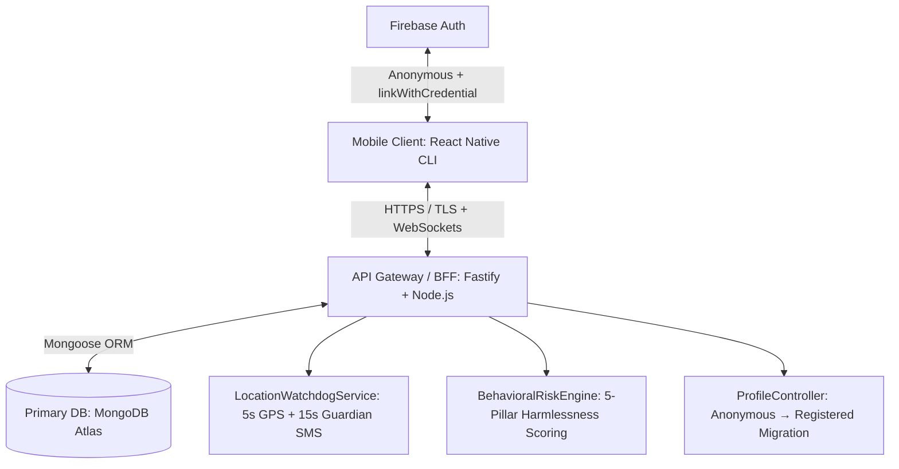

# 1. Project Analysis Report

## 1.1 Project Overview
**Connify** is a decentralized, zero-trust proximity safety coordination protocol implemented as a mobile application. Rather than building a centralized identity directory or permanent reputation scores (which invite surveillance and compromise), Connify relies on **single-use trust relationships** established dynamically between two devices in physical proximity.

This is referred to as the **SHARP (Secure Proximity Handshake & Relayed Protocol)**:
* **Episode ID**: An ephemeral, UUIDv4 transactional identifier that isolates the transaction.
* **Trust Capsule**: A signed, time-bound, single-use JWT authorizing helper contact and ephemeral communications.
* **Environmental Signal Tag**: Client-side Bloom filters containing local environmental signals (Wi-Fi frame headers & LTE TC-RNTI control messages) to prevent location spoofing.
* **BCH Syndrome Key Exchange**: Error-correcting fuzzy extractors reconstruct session key $K$ from noisy proximity data.
* **Grid Index Blinding**: Fine-grained proximity verification using blinded grid cells, keeping exact locations oblivious to the server.

---

## 1.2 New Safety Systems (Implemented — v2.0)

The following safety systems have been fully built, tested, and verified with **27/27 integration tests passing (100%)**:

### 5-Pillar Harmlessness & Threat Assessment System
The backend calculates a real-time **Harmlessness Risk Score** before any distress episode is broadcast to nearby helpers:
1. **Trap & Velocity Detection**: Blocks devices triggering ≥ 3 episodes within a 10-minute window (predatory luring prevention).
2. **Dual-Sided Anonymity (SHARP Protocol)**: Responders receive only blinded proximity — never raw GPS or identity.
3. **Historical Resolution Ratio**: Tracks percentage of past episodes that ended in verified resolutions vs suspicious cancellations.
4. **Responder Panic Abort**: Responders can trigger `POST /api/episodes/:id/threat-abort` to flag suspicious senders.
5. **Automated Quarantine**: Accounts with ≥ 2 SUSPICIOUS_BEHAVIOR ratings are automatically quarantined (`isQuarantined: true`) and blocked from creating new episodes.

### 5-Second GPS Watchdog & Guardian SMS Alert System
* Every 5 seconds the device atomically **overwrites** its GPS record in MongoDB (`DeviceLocation` model).
* If no GPS ping is received for **15 seconds**, the `LocationWatchdogService` dispatches a personalized **Guardian SMS Alert** containing the user's full name, relationship, last known coordinates (read directly from MongoDB), and a live Google Maps link.
* If signal is regained (at any time — after power-off, Airplane mode, or extended blackout), a **Signal Recovered SMS** is dispatched immediately using the newly written DB coordinates.
* **Guardian registration is mandatory** — emergency episodes are blocked without a registered guardian on file.

### Anonymous → Registered Profile Migration (Firebase + MongoDB)
* Users launch Connify via **Firebase Anonymous Auth** (`signInAnonymously`).
* When onboarding is completed, the client calls `linkWithCredential(anonymousUser, credential)` to preserve the Firebase UID without creating a duplicate account.
* The backend exposes `POST /api/profile/upgrade` which atomically:
  - Marks `isAnonymous: false` in the `Profile` MongoDB document.
  - Binds `firebaseUid`, `firstName`, `lastName`, `phone`, `email` to the `deviceId`.
  - Creates or updates the mandatory `Guardian` record.
  - Writes audit log: `PROFILE_MIGRATED_FROM_ANONYMOUS`.

---

## 1.3 High-Level System Architecture

### Server-Side Layer
1. **API Gateway / Web Service (Fastify + TypeScript)**: Request routing, rate-limiting, and validation.
2. **Database (MongoDB Atlas + Mongoose)**: Stores `Device`, `Episode`, `Profile`, `Guardian`, `DeviceLocation`, `Outcome`, and `AuditLog` models.
3. **LocationWatchdogService**: 5-second atomic GPS pings, 15-second signal loss detection, unbounded signal recovery alerts, personalized Guardian SMS dispatch.
4. **BehavioralRiskEngine**: Real-time 5-pillar harmlessness scoring, trap velocity detection, auto-quarantine on suspicious behavior.
5. **ProfileController**: Anonymous-to-Registered migration with Firebase UID binding and mandatory guardian enforcement.

---

## 1.4 Threat Model & Security Controls

| Identified Threat | System Countermeasure / Control |
|---|---|
| **GPS Spoofing** | Proximity checks combine GPS with local Wi-Fi frames & LTE identifiers loaded into a Bloom filter. |
| **Replay Attacks** | Ed25519-signed 60-second challenge nonces, single-use replay defense tracked per device. |
| **Predatory Luring** | Velocity trap detection blocks ≥ 3 episodes in a 10-minute window per device. |
| **Signal Loss / Phone Off** | 15s watchdog dispatches Guardian SMS with last DB coordinates; unbounded recovery SMS on reconnect. |
| **No Guardian On File** | Episodes are strictly blocked if no guardian is registered; mandatory at `POST /api/profile/upgrade`. |
| **Surveillance Creep** | Outcome logging contains zero identities, location logs, or chat contents. Ephemeral channels auto-destruct on capsule expiry. |
| **Anonymous Impersonation** | Firebase `linkWithCredential()` preserves UID continuity; `PROFILE_MIGRATED_FROM_ANONYMOUS` audit log written. |
| **Private Key Exposure** | Device-bound Ed25519 signing keys stored in hardware-backed secure storage (iOS Keychain / Android Keystore). |

---

## 1.5 Codebase & Tooling Alignment

* **Frontend CLI**: React Native CLI (`0.86.0`) with TypeScript. Uses vanilla Stylesheets and Native modules.
* **Backend Runtime**: Node.js (`20+ LTS`) running Fastify (`5.10.0`) + TSX.
* **Database**: MongoDB Atlas (Mongoose ORM) — migrated from PostgreSQL/Prisma.
* **Auth**: Firebase Auth (Anonymous + Account Linking via `linkWithCredential`).
* **SMS Alerts**: Guardian SMS dispatched via `LocationWatchdogService` with personalized full name, relationship, and live Google Maps coordinates.
* **Deployment Platform**: Render hosting services (Web Service) configured in a single region.
* **Integration Test Coverage**: **27/27 tests passing (100%)** across 4 suites: Symmetric Verification Pipeline, 5-Pillar Harmlessness, Location Watchdog Guardian SMS, and Profile Migration.
