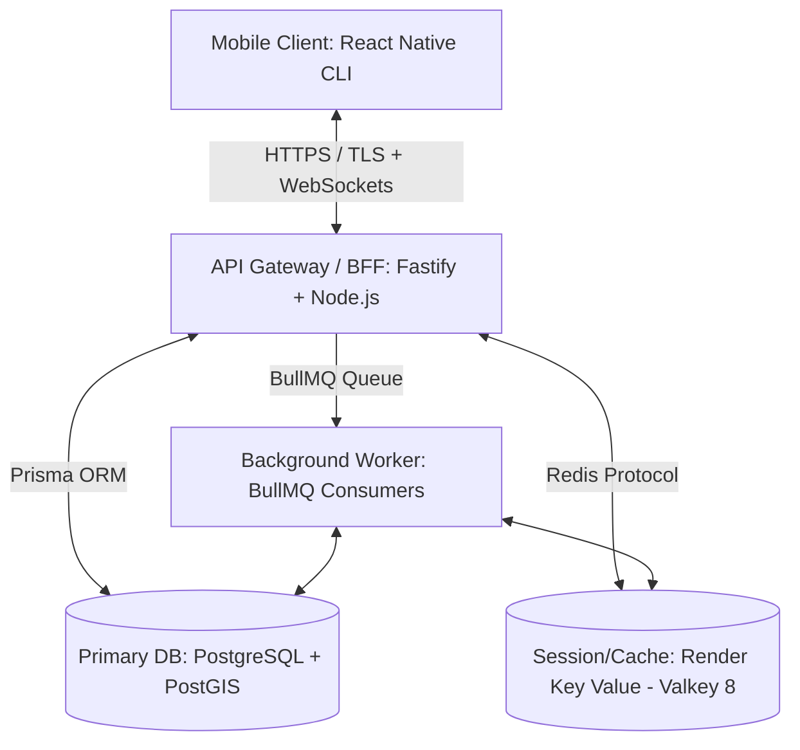

# 1. Project Analysis Report

## 1.1 Project Overview
**Connify** is a decentralized, zero-trust proximity safety coordination protocol implemented as a mobile application. Rather than building a centralized identity directory or permanent reputation scores (which invite surveillance and compromise), Connify relies on **single-use trust relationships** established dynamically between two devices in physical proximity.

This is referred to as the **SHARP (Secure Proximity Handshake & Relayed Protocol)**:
* **Episode ID**: An ephemeral, UUIDv4 transactional identifier that isolates the transaction.
* **Trust Capsule**: A signed, time-bound, single-use JWT authorizing helper contact and ephemeral communications.
* **Environmental Signal Tag**: Client-side Bloom filters containing local environmental signals (Wi-Fi frame headers & LTE TC-RNTI control messages) to prevent location spoofing.
* **BCH Syndrome Key Exchange**: Error-correcting fuzzy extractors reconstruct session key $K$ from noisy proximity data.
* **Grid Index Blinding**: Fine-grained proximity verification using blinded grid cells, keeping exact locations oblivious to the server.

---

## 1.2 High-Level System Architecture

### Server-Side Layer
1. **API Gateway / Web Service (Fastify + TypeScript)**: Request routing, rate-limiting, and validation. Serves as the Socket.IO gateway.
2. **Database (Render Postgres 16 + PostGIS)**: Stores relational models (`devices`, `episodes`, `capsules`, `outcomes`, `audit_log`) and performs coarse spatial queries.
3. **Session Store (Valkey 8 / Redis)**: Handles rate limit counters, Socket.IO pub/sub, single-use active capsule locks (`SET NX`), and BullMQ jobs.
4. **Background Worker**: Purpose-built consumer for BullMQ queues checking for capsule expirations, match timeouts, and data-retention purges.

---

## 1.3 Threat Model & Security Controls

| Identified Threat | System Countermeasure / Control |
|---|---|
| **GPS Spoofing** | Proximity checks combine GPS with local Wi-Fi frames & LTE identifiers loaded into a Bloom filter. |
| **Replay Attacks** | Trust Capsules are single-use (`SET capsule:{id} used NX EX {ttl}`) and bound to exactly 1 request + 1 helper + 1 short time window. |
| **Surveillance Creep** | Outcome logging contains zero identities, location logs, or chat contents. Ephemeral channels auto-destruct on capsule expiry. |
| **Database Breaches** | Bearer tokens are stored as SHA-256 hashes (`signed_token_hash`), so leaked DB records cannot be replayed. Location data is deleted upon task completion. |
| **Private Key Exposure** | Device-bound Ed25519 signing keys are stored inside hardware-backed secure storage (iOS Keychain / Android Keystore), never in plaintext local storage. |

---

## 1.4 Codebase & Tooling Alignment

* **Frontend CLI**: React Native CLI (`0.86.0`) with TypeScript. Uses vanilla Stylesheets and Native modules.
* **Backend Runtime**: Node.js (`20+ LTS`) running Fastify (`5.10.0`), TSX, and Prisma (`7.8.0`).
* **Deployment Platform**: Render hosting services (Web Service, Postgres, Valkey Key Value, and Background Workers) configured in a single region to eliminate cross-region latency.
