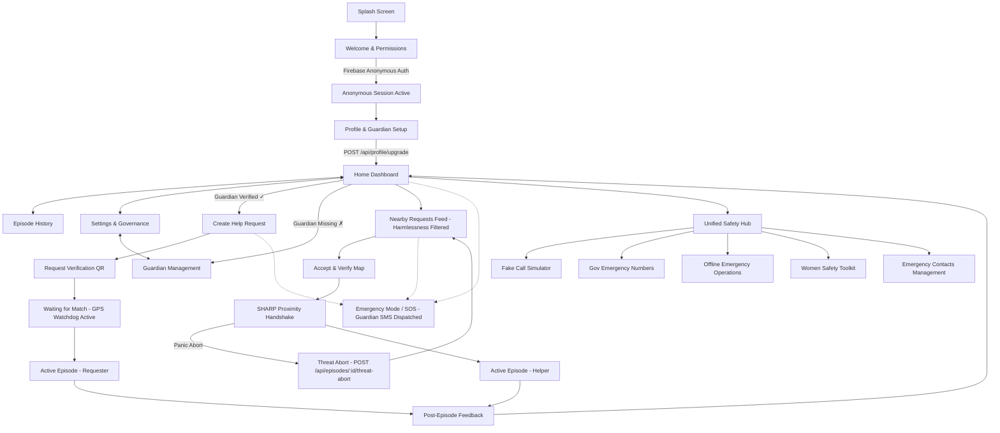

# 4. Navigation Map

This document defines the routing configuration, view hierarchy, and navigation flow of the Connify Mobile application.

## 4.1 Mobile Navigation Tree

The application is structured into four primary navigation paths: **Onboarding & Profile Migration stack**, **Main application tabs**, **Transactional workflow overlays** (Requester stack and Helper stack), and the **Guardian Management modal**.

---

## 4.2 Route Definitions (React Navigation)

The mobile client leverages `@react-navigation/native-stack` for workflows and `@react-navigation/bottom-tabs` for the main dashboard view structure.

### 4.2.1 Auth / Onboarding Stack (No Session)
* `Splash`: Initializes Firebase Anonymous Auth silently. Generates Ed25519 key pair stored in hardware-backed secure storage (Keychain / Keystore).
* `Welcome`: Guidelines, protocol explanations, and system permissions (Location, Notifications, Camera).
* `HomeSetup`: **[NEW v2.0]** — Profile & Guardian Registration. Calls `POST /api/profile/upgrade`. Upgrade is mandatory before episode creation.

### 4.2.2 Main Tab Navigator (Active Session)
* `Dashboard`: Main operations center. Contains toggles for Requester / Helper roles. "I NEED HELP" button blocked if no guardian registered.
* `EpisodeHistory`: Decoupled historical log list showing safe session outcomes.
* `SettingsGovernance`: Configuration for local keys, witness contacts, and data purge controls. Includes **Guardian Management** subsection.

### 4.2.3 Requester Workflow Stack
* `CreateHelpRequest`: Form for category selection, urgency level, and approximate location. Backend validates: guardian exists, device not quarantined, velocity trap limit not reached.
* `RequestVerification`: Renders the time-bound QR code containing BCH syndromes.
* `WaitingForMatch`: Live WebSocket listener. **5-second GPS Watchdog pings active** (`POST /api/locations/ping`). 15-second signal loss triggers Guardian SMS.
* `ActiveEpisodeRequester`: Real-time chat, call, capsule countdown. GPS Watchdog status badge visible.

### 4.2.4 Helper Workflow Stack
* `NearbyRequests`: Filtered feed of open items. **Quarantined or velocity-trapped senders are hidden.**
* `AcceptVerify`: Helper path mapping routing directions.
* `AcceptVerifyHandshake`: Scans the QR and executes fuzzy extractor syndrome calculations and local Wi-Fi checks. **[NEW v2.0]** "REPORT THREAT" / "PANIC ABORT" action available — triggers `POST /api/episodes/:id/threat-abort`.
* `ActiveEpisodeHelper`: Responder dashboard with capsule timer and comms relays.

### 4.2.5 Feedback & Global Modals
* `ProtocolFeedback`: **[UPDATED v2.0]** Three-way outcome selection: `SAFE_RESOLVED`, `SUSPICIOUS_BEHAVIOR`, `ACTIVE_THREAT`. Auto-quarantine triggered on ≥ 2 suspicious flags.
* `EmergencyMode`: Global SOS overlay bypasses normal stack. **[v2.0]** Immediately dispatches Guardian SMS with last MongoDB GPS coordinates.
* `GuardianManagement`: **[NEW v2.0]** Dedicated modal for adding/editing Guardian's full name, phone, and relationship. Mandatory before any episode creation.

### 4.2.6 Unified Safety Hub Stack [NEW v2.0]
* `UnifiedSafetyHub`: Centralized dashboard for active prevention tools and offline utilities.
* `FakeCall`: Initiates a simulated incoming call with configurable timers to deter harassment.
* `GovernmentEmergencyNumbers`: Directory of official local emergency services with one-tap dialing.
* `OfflineEmergency`: Fallback dispatch via direct SMS and Bluetooth when out of cell range.
* `WomenSafety`: Focused toolkit for rapid trusted-contact sharing and discreet alerts.
* `EmergencyContacts`: Manage the list of trusted guardians and secondary emergency contacts.

---

## 4.3 Backend API Route Map (v2.0)

| Route | Method | Auth | Description |
|---|---|---|---|
| `POST /api/episodes` | POST | ✓ | Create episode — blocked if quarantined / no guardian / velocity trap |
| `POST /api/episodes/:id/threat-abort` | POST | ✓ | Responder panic abort — flags sender, increments `suspiciousCount` |
| `POST /api/outcomes` | POST | ✓ | Log outcome: `SAFE_RESOLVED`, `SUSPICIOUS_BEHAVIOR`, `ACTIVE_THREAT` |
| `POST /api/locations/ping` | POST | ✓ | 5s atomic GPS overwrite in MongoDB; triggers recovery SMS if signal was lost |
| `POST /api/locations/guardians` | POST | ✓ | Register / update Guardian record for device |
| `POST /api/locations/watchdog/scan` | POST | ✓ | Watchdog scan — dispatches Guardian SMS for devices silent for ≥ 15s |
| `POST /api/profile/upgrade` | POST | ✓ | Upgrade anonymous profile to registered; bind `firebaseUid`; create Guardian |
| `GET /api/profile` | GET | ✓ | Fetch profile for authenticated device |
