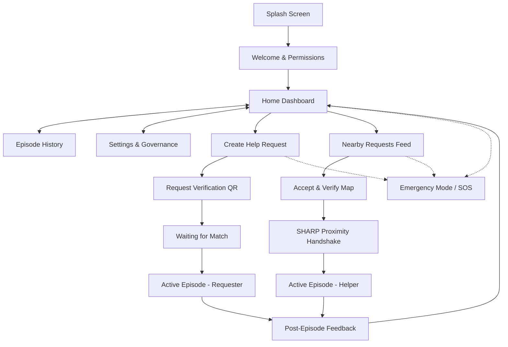

# 4. Navigation Map

This document defines the routing configuration, view hierarchy, and navigation flow of the Connify Mobile application.

## 4.1 Mobile Navigation Tree

The application is structured into three primary navigation paths: **Onboarding stack**, **Main application tabs**, and **Transactional workflow overlays** (Requester stack and Helper stack).

---

## 4.2 Route Definitions (React Navigation)

The mobile client leverages `@react-navigation/native-stack` for workflows and `@react-navigation/bottom-tabs` for the main dashboard view structure.

### 4.2.1 Auth / Onboarding Stack (No Session)
* `Splash`: Initializing cryptographic modules and verifying local device keys.
* `Welcome`: Guidelines, protocol explanations, and system permissions (Location, Notifications, Camera).
* `HomeSetup`: Initializing safety profiles and binding keys.

### 4.2.2 Main Tab Navigator (Active Session)
* `Dashboard`: Main operations center. Contains toggles for Requester / Helper roles.
* `EpisodeHistory`: Decoupled historical log list showing safe session outcomes.
* `SettingsGovernance`: Configuration for local keys, witness contacts, and data purge controls.

### 4.2.3 Requester Workflow Stack
* `CreateHelpRequest`: Form for category selection, urgency level, and Approximate location.
* `RequestVerification`: Renders the time-bound QR code containing BCH syndromes.
* `WaitingForMatch`: Live WebSocket listener searching for verified candidates.
* `ActiveEpisodeRequester`: Real-time chat, call, and capsule countdown.

### 4.2.4 Helper Workflow Stack
* `NearbyRequests`: Filtered feed of open items.
* `AcceptVerify`: Helper path mapping routing directions.
* `AcceptVerifyHandshake`: Scans the QR and executes fuzzy extractor syndrome calculations and local Wi-Fi checks.
* `ActiveEpisodeHelper`: Responder dashboard with capsule timer and comms relays.

### 4.2.5 Feedback & Global Modals
* `ProtocolFeedback`: Clean slate post-episode evaluation sheet.
* `EmergencyMode`: Global SOS overlay bypasses normal stack, broadcasting urgency metrics.
