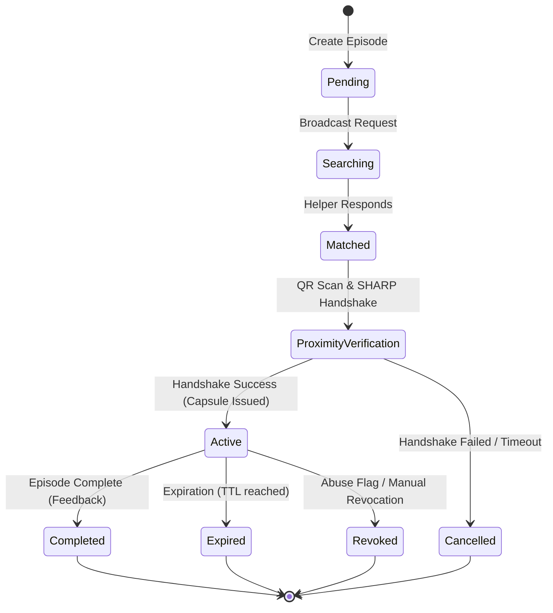

# 5. User Flow

This document details the step-by-step user interactions and state transitions for the core Connify workflows.

---

## 5.1 Requester Journey

```
[Create Request] ➔ [Select Urgency] ➔ [Coarse Location] ➔ [Generate QR] ➔ [Wait for Match] ➔ [Active Help Stack] ➔ [Submit Feedback & Purge]
```

1. **Initiation**: Alice opens the app to the **Dashboard** and presses **I NEED HELP**.
2. **Category Selection**: Selects medical, security, transport, or other emergency category.
3. **Urgency Metric**: Adjusts the scale slider (1 to 5) indicating danger level.
4. **General Location**: Device captures approximate location coordinates (coarse grid coordinates, not exact street numbers).
5. **Syndrome Verification QR**: System generates a QR containing Alice's location tag syndromes (BCH syndromes) and helper string $y$.
6. **Broadcasting**: Alice submits and enters the **Searching for Help** state.
7. **Connection**: Once matched, the server initializes an ephemeral WebSocket channel. Alice's device verifies Bob's blinded grid cell response.
8. **Trust Capsule**: A JIT-issued Trust Capsule is minted and signed.
9. **Active Assistance**: Alice chats or calls Bob over the secure, time-bound connection.
10. **Resolution**: Alice clicks **Complete Episode**. The system opens the **Feedback Screen**, purges local session caches, and stores outcome status (Resolved/Unresolved).

---

## 5.2 Helper Journey

```
[Active Helper Feed] ➔ [Anonymized Request] ➔ [Scan QR Proximity] ➔ [Verify local signals] ➔ [Decrypt session key K] ➔ [Redeem Capsule] ➔ [Active Comms] ➔ [Purge]
```

1. **Activation**: Bob opens the app, navigates to the dashboard, and toggles **I CAN HELP**.
2. **Feed Review**: Views anonymized proximity list. Each card displays rough distance (e.g. `~400m away`), urgency tier, and category.
3. **Acceptance**: Bob hits **Respond Now** and views navigation directions.
4. **Meeting & Proximity Handshake**: Bob arrives and scans Alice's QR.
5. **SHARP Verification**:
   * Bob's app captures local Wi-Fi beacon frame headers and LTE TC-RNTI messages, converting them to a local Bloom filter.
   * Applying BCH syndrome error correction (from Alice's QR), the app decrypts the temporary session key $K$.
   * Bob's app computes blinded grid index $B = \mathcal{H}'(K, b \mathbin{\Vert} \text{"Bob"})$ and submits it.
6. **Capsule Issuance**: The server validates the response against Alice's record. If verified, the server issues Bob a short-lived Trust Capsule (Ed25519 JWT) stored in `@react-native-async-storage/async-storage` (metadata) and `expo-secure-store` (signing keys/tokens).
7. **Active Assistance**: Bob's app enables direct communication channels (ephemeral chat and call).
8. **Completion**: Once complete, the capsule auto-invalidates or Bob triggers **Complete Episode**, purging the token and closing channels.

---

## 5.3 Emergency Override Flow (SOS Trigger)

```
[SOS Press] ➔ [Immediate Broadcast] ➔ [Emergency Dispatch Alert] ➔ [Log Out-of-band Token]
```

1. **Trigger**: User presses and holds the **SOS** button on any screen for 3 seconds.
2. **Override**: Bypasses normal verification queues, immediately broadcasting location coordinates to all verified helpers within a 2km radius.
3. **Dispatch**: (Optional) Sends out an automated notification hook to municipal emergency dispatch services.
4. **Logging**: Outcome Logging stores a high-risk category indicator.

---

## 5.4 State Machine Transition Map


