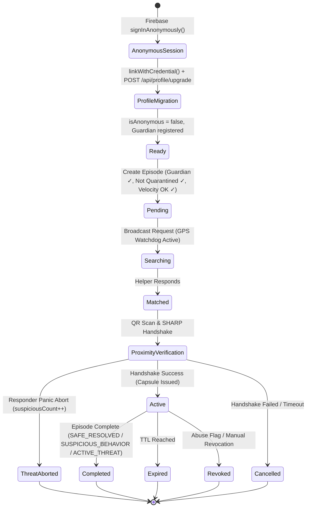

# 5. User Flow

This document details the step-by-step user interactions and state transitions for the core Connify workflows, updated to reflect the v2.0 safety systems.

---

## 5.0 Pre-Session: Anonymous → Registered Profile Migration (NEW v2.0)

```
[App Launch] ➔ [Firebase Anonymous Auth] ➔ [Ed25519 Key Generation] ➔ [Profile Setup] ➔ [Guardian Registration] ➔ [linkWithCredential()] ➔ [POST /api/profile/upgrade] ➔ [Session Active]
```

1. **Launch**: App launches — Firebase `signInAnonymously()` is called silently. An anonymous `firebaseUid` is assigned.
2. **Key Generation**: Device generates an Ed25519 key pair. Public key is registered with the backend (`POST /api/devices/register`). Private key is stored in hardware-backed secure storage (iOS Keychain / Android Keystore).
3. **Profile Onboarding**: User fills in `firstName`, `lastName`, `phone`, and `email`.
4. **Guardian Registration (Mandatory)**: User must provide guardian `fullName`, `phone`, and `relationship`. This is enforced — no episodes can be created without it.
5. **Account Linking**: Client calls Firebase `linkWithCredential(anonymousUser, emailOrPhoneCredential)`. The anonymous UID is preserved — no duplicate account is created.
6. **Backend Upgrade**: Client calls `POST /api/profile/upgrade` with `firebaseUid`, profile data, and guardian data.
   - MongoDB `Profile` document: `isAnonymous` set to `false`.
   - MongoDB `Guardian` document: created and bound to `deviceId`.
   - Audit log written: `PROFILE_MIGRATED_FROM_ANONYMOUS`.
7. **Ready**: User proceeds to the Home Dashboard with full episode creation privileges.

---

## 5.1 Requester Journey

```
[Create Request] ➔ [Backend Validates: Guardian ✓, Not Quarantined ✓, Velocity OK ✓] ➔ [Select Urgency] ➔ [Coarse Location] ➔ [GPS Watchdog Active] ➔ [Generate QR] ➔ [Wait for Match] ➔ [Active Help Stack] ➔ [Submit Feedback & Purge]
```

1. **Initiation**: Alice opens the app to the **Dashboard** and presses **I NEED HELP**.
2. **Backend Pre-Checks** (5-Pillar Harmlessness Engine):
   - Verifies at least 1 guardian is registered (`Guardian.find({ deviceId })`).
   - Checks device is not quarantined (`isQuarantined: false`).
   - Checks velocity trap limit: < 3 episodes created in the last 10 minutes.
3. **Category Selection**: Selects medical, security, transport, or other emergency category.
4. **Urgency Metric**: Adjusts the scale slider (1 to 5) indicating danger level.
5. **General Location**: Device captures approximate location coordinates (coarse grid, not exact).
6. **GPS Watchdog Starts**: Client begins sending `POST /api/locations/ping` every 5 seconds with fresh GPS coordinates. MongoDB atomically overwrites the previous location record.
7. **Syndrome Verification QR**: System generates a QR containing Alice's location tag syndromes (BCH syndromes) and helper string $y$.
8. **Broadcasting**: Alice submits and enters the **Searching for Help** state.
9. **Signal Loss Guard**: If GPS ping is not received for ≥ 15 seconds (phone powered off, Airplane mode, signal blackout):
   - Backend `LocationWatchdogService` dispatches a **personalized Guardian SMS** with the guardian's name, relationship, Alice's full name, last known MongoDB coordinates, and a live Google Maps link.
   - On reconnect: a **Signal Recovered SMS** is dispatched immediately with fresh coordinates.
10. **Connection**: Once matched, the server initializes an ephemeral WebSocket channel. Alice's device verifies Bob's blinded grid cell response.
11. **Trust Capsule**: A JIT-issued Trust Capsule is minted and signed (Ed25519 JWT).
12. **Active Assistance**: Alice chats or calls Bob over the secure, time-bound connection.
13. **Resolution**: Alice clicks **Complete Episode**. The system opens the **Feedback Screen**, purges local session caches, and stores outcome status.

---

## 5.2 Helper Journey

```
[Active Helper Feed - Harmlessness Filtered] ➔ [Anonymized Request] ➔ [Scan QR Proximity] ➔ [Verify local signals] ➔ [Optional: Panic Abort] ➔ [Decrypt session key K] ➔ [Redeem Capsule] ➔ [Active Comms] ➔ [Feedback & Purge]
```

1. **Activation**: Bob opens the app, navigates to the dashboard, and toggles **I CAN HELP**.
2. **Feed Review**: Views anonymized proximity list. **Requests from quarantined or velocity-flagged senders are hidden by the `BehavioralRiskEngine`.** Each card displays rough distance (e.g. `~400m away`), urgency tier, and category.
3. **Acceptance**: Bob hits **Respond Now** and views navigation directions.
4. **Meeting & Proximity Handshake**: Bob arrives and scans Alice's QR.
5. **SHARP Verification**:
   * Bob's app captures local Wi-Fi beacon frame headers and LTE TC-RNTI messages, converting them to a local Bloom filter.
   * Applying BCH syndrome error correction (from Alice's QR), the app decrypts the temporary session key $K$.
   * Bob's app computes blinded grid index $B = \mathcal{H}'(K, b \mathbin{\Vert} \text{"Bob"})$ and submits it.
6. **Responder Panic Abort (NEW v2.0)**: If Bob detects suspicious or threatening behavior at the scene:
   * Bob taps **REPORT THREAT** → calls `POST /api/episodes/:id/threat-abort`.
   * Alice's device `suspiciousCount` is incremented. If ≥ 2, her account is automatically quarantined (`isQuarantined: true`).
   * Episode is flagged as `SUSPICIOUS_BEHAVIOR` and closed immediately.
7. **Capsule Issuance**: Server validates response against Alice's record. If verified, issues Bob a short-lived Trust Capsule (Ed25519 JWT) stored in `@react-native-async-storage/async-storage` (metadata) and `expo-secure-store` (signing keys/tokens).
8. **Active Assistance**: Bob's app enables direct communication channels (ephemeral chat and call).
9. **Completion**: Bob triggers **Complete Episode** and submits `SAFE_RESOLVED`, `SUSPICIOUS_BEHAVIOR`, or `ACTIVE_THREAT` as the outcome. Token invalidated, channels purged.

---

## 5.3 Emergency Override Flow (SOS Trigger)

```
[SOS Press] ➔ [Immediate Broadcast] ➔ [Guardian SMS Dispatched with DB Location] ➔ [Emergency Dispatch Alert] ➔ [Log Out-of-band Token]
```

1. **Trigger**: User presses and holds the **SOS** button on any screen for 3 seconds.
2. **Override**: Bypasses normal verification queues, immediately broadcasting location coordinates to all verified helpers within a 2km radius.
3. **Guardian SMS (NEW v2.0)**: Guardian SMS is dispatched immediately with the last GPS coordinates stored in MongoDB and a live Google Maps link.
4. **Dispatch**: (Optional) Sends out an automated notification hook to municipal emergency dispatch services.
5. **Logging**: Outcome Logging stores a high-risk category indicator.

---

## 5.4 GPS Watchdog & Signal Recovery Flow (NEW v2.0)

```
[Active Session] ➔ [5s GPS Ping → MongoDB Atomic Overwrite] ➔ [Signal Lost ≥ 15s] ➔ [Guardian SMS with DB Coordinates] ➔ [Signal Regained] ➔ [Recovery SMS with New DB Coordinates]
```

1. Every 5 seconds, device sends `POST /api/locations/ping` with fresh `latitude`, `longitude`, `accuracy`.
2. MongoDB `DeviceLocation` record is atomically overwritten (previous record deleted upon new data received).
3. If no ping received for ≥ 15 seconds (`signalLostAlertSent: false`, `lastPingAt < cutoff`):
   * `LocationWatchdogService.checkSignalLossAndNotifyGuardians()` fires.
   * Guardian SMS dispatched: reads coordinates directly from MongoDB (never hardcoded). Contains user's full name, guardian's relationship, last known GPS coordinates, and a live Google Maps link.
   * `retryCount` incremented. No limit on retries.
4. When signal returns (any time — 15 seconds, 1 hour, or after power-off):
   * Fresh GPS ping arrives → MongoDB updated.
   * **Signal Recovered SMS** dispatched immediately with new coordinates from MongoDB.

---

## 5.5 Unified Safety Hub Utilities Flow (NEW v2.0)

```
[Dashboard] ➔ [Safety Hub] ➔ [Select Tool: Fake Call / Offline Mode / Women Safety] ➔ [Execute Utility]
```

1. **Access**: User navigates to the Unified Safety Hub from the main dashboard.
2. **Emergency Contacts Management**: User can dynamically add or remove trusted secondary contacts.
3. **Fake Call Simulator**: User configures caller ID and sets a timer (e.g., 5s, 30s). An incoming call simulation is triggered to deter harassment.
4. **Offline Emergency Mode**: If cellular data is lost, user can execute direct SMS dispatch to pre-configured guardians and initialize local Bluetooth LE broadcasts.
5. **Women Safety Toolkit**: specialized sub-tools for discreet SOS triggering without visual/audio indicators.

---

## 5.6 State Machine Transition Map (Updated v2.0)


