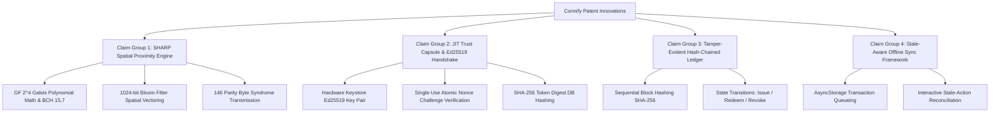
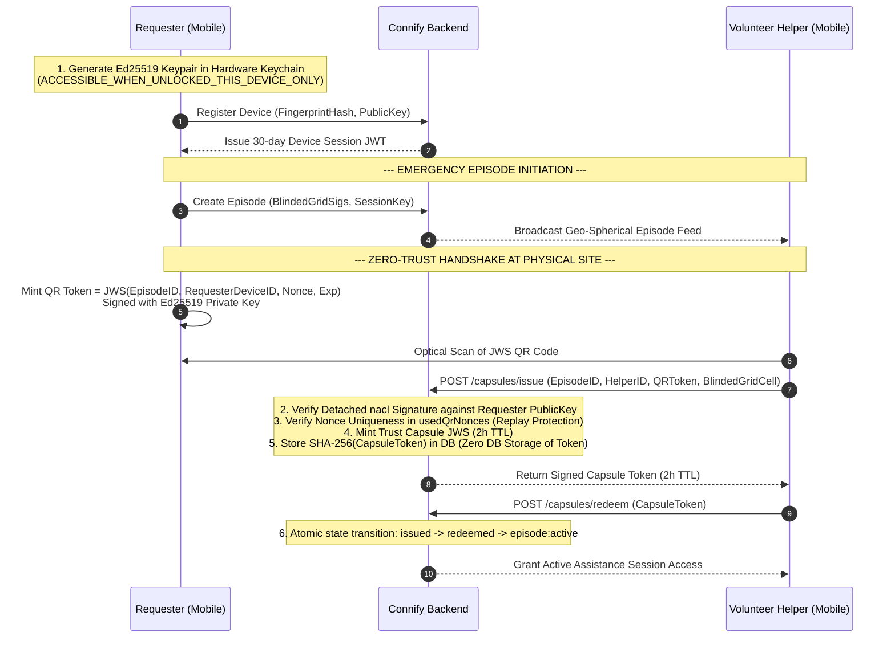
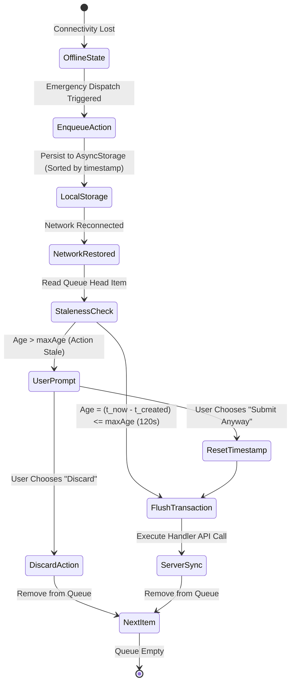

# Connify System: Technical Specification & Patent Application Blueprint
> **Source Verification Notice**: This technical specification has been constructed **exclusively** from deep static analysis of the implemented source code files (`.ts`, `.tsx`, `.prisma`, `__tests__`) across the `backend`, `Connify`, `Instantsite`, and `App_UI` codebases. No external documentation files were referenced.

---

## 1. Executive Summary & Abstract of Invention

### Abstract
A privacy-preserving, zero-trust emergency safety and volunteer response system engineered to facilitate secure, location-verified assistance while eliminating raw geolocation disclosure and centralized identity compromise risks. 

The system implements a novel cryptographic protocol suite comprising four primary technological innovations:
1. **Syndrome-Based Error-Correction Spatial Matching (SHARP Protocol)** using Galois Field $\text{GF}(2^4)$ arithmetic and $\text{BCH}(15,7)$ error-correcting codes mapped over partitioned 1024-bit Bloom filter spatial vectors.
2. **Zero-Trust Just-In-Time (JIT) Ephemeral Access Capsules** backed by hardware-derived Ed25519 key pairs, single-use challenge nonces, and zero-storage token hashing.
3. **Tamper-Evident Hash-Chained Audit Ledger** executing $H_n = \text{SHA-256}(H_{n-1} \parallel \text{Event} \parallel \text{EpisodeID})$ across emergency lifecycles.
4. **Stale-Aware Offline Queue & Opportunistic Synchronization Engine** with dynamic transaction freshness verification ($T_{\text{age}} \le T_{\text{max}}$).

---

## 2. Patentable Claim Architecture & Technical Innovations



---

## 3. Deep-Dive Technical Claims & Implemented Code Analysis

### Claim Group 1: Zero-Knowledge Spatial Proximity Discovery via Syndrome Error Correction (SHARP Engine)

#### Code Files Referenced:
- Backend Utility: [backend/src/utils/sharp.ts](file:///o:/PROJECTS/CONNIFY-APP/backend/src/utils/sharp.ts#L1-L339)
- Mobile Utility: [Connify/src/utils/sharp.ts](file:///o:/PROJECTS/CONNIFY-APP/Connify/src/utils/sharp.ts)
- Mobile Requester Broadcast: [CreateRequestScreen.tsx](file:///o:/PROJECTS/CONNIFY-APP/Connify/src/screens/Requester/CreateRequestScreen.tsx#L96-L138)
- Mobile Helper Discovery: [NearbyRequestsScreen.tsx](file:///o:/PROJECTS/CONNIFY-APP/Connify/src/screens/Helper/NearbyRequestsScreen.tsx#L22-L235)
- Unit & Protocol Verification: [sharp.test.ts](file:///o:/PROJECTS/CONNIFY-APP/Connify/__tests__/sharp.test.ts#L1-L121)

#### Technical Novelty & Mathematical Formulation:
1. **Galois Field $\text{GF}(2^4)$ Arithmetic Framework**:
   The engine initializes arithmetic over $\text{GF}(2^4)$ using primitive generator polynomial $p(x) = x^4 + x + 1$ (represented as `0x13` / `0x1D1` with 8-bit extension):
   ```typescript
   // o:\PROJECTS\CONNIFY-APP\backend\src\utils\sharp.ts (Lines 116-129)
   let val = 1;
   for (let i = 0; i < 15; i++) {
     GF_EXP[i] = val; GF_EXP[i + 15] = val; GF_LOG[val] = i;
     val <<= 1;
     if (val & 0x10) val ^= 0x13;
   }
   ```
2. **$\text{BCH}(15,7)$ Code Construction & Syndrome Calculation**:
   - Converts 7-bit spatial chunks ($m_7$) into 15-bit codewords ($c_{15}$) via generator polynomial $G(x) = \mathtt{0x1D1}$:
     $$c_{15} = (m_7 \ll 8) \oplus \text{rem}(m_7 \ll 8, G(x))$$
   - Corrects single-bit and double-bit spatial discretization errors (GPS noise/drift):
     ```typescript
     // Lines 152-162 & 184-197
     const det = gfAdd(gfMul(s[1], s[3]), gfMul(s[2], s[2]));
     l1 = gfDiv(gfAdd(gfMul(s[2], s[3]), gfMul(s[1], s[4])), det);
     l2 = gfDiv(gfAdd(gfMul(s[3], s[3]), gfMul(s[2], s[4])), det);
     ```
3. **Bloom Filter Vectorization & Spatial Blinding**:
   - continuous coordinates $(lat, lng)$ are rounded to 3 decimal places and converted to 9-grid beacon neighborhood cells (`beacon_lat_lng`).
   - Signals are inserted into a 1024-bit Bloom filter using 4 FNV-1a hash functions (`fnv1a32`).
   - The 1024-bit vector is segmented into 146 distinct 7-bit blocks. Each block is $\text{BCH}$-encoded to extract an 8-bit parity syndrome.
   - **Privacy Boundary**: Transmits **only** 146 parity bytes (292 hex characters) and salt-blinded grid strings (`SHA-256(SessionKey : CellID : Role)`) to the server. Neither server nor eavesdroppers receive raw GPS coordinates.

---

### Claim Group 2: Zero-Trust Ephemeral Access Control (JIT Trust Capsules) & Ed25519 Hardware Handshake

#### Code Files Referenced:
- Database Schema: [schema.prisma](file:///o:/PROJECTS/CONNIFY-APP/backend/prisma/schema.prisma#L14-L67)
- Key Cryptography Service: [KeyService.ts](file:///o:/PROJECTS/CONNIFY-APP/backend/src/services/KeyService.ts#L1-L117)
- Hardware Keystore Service: [secureKeyService.ts](file:///o:/PROJECTS/CONNIFY-APP/Connify/src/services/secureKeyService.ts#L1-L96)
- Capsule Controller: [CapsuleController.ts](file:///o:/PROJECTS/CONNIFY-APP/backend/src/controllers/CapsuleController.ts#L1-L294)
- Hardware Challenge Controller: [DeviceController.ts](file:///o:/PROJECTS/CONNIFY-APP/backend/src/controllers/DeviceController.ts#L81-L196)
- Mobile Handshake Screen: [HandshakeScreen.tsx](file:///o:/PROJECTS/CONNIFY-APP/Connify/src/screens/Helper/HandshakeScreen.tsx#L70-L135)

#### Technical Workflow & Architectural Sequence:



#### Key Patent Innovations:
1. **Hardware-Anchored Device Identity**: Asymmetric Ed25519 key pairs created via `nacl.sign.keyPair()` are written directly to secure hardware (`Keychain.ACCESSIBLE.WHEN_UNLOCKED_THIS_DEVICE_ONLY`).
2. **Single-Use Challenge-Response Handshake**: The backend issues 32-byte cryptographically secure random nonces (`randomBytes(32)`), which are atomically deleted upon first verification attempt (`findOneAndDelete`) to enforce zero-replay security.
3. **Optical Detached JWS Verification**: Requesters encode an Ed25519-signed JSON Web Signature containing a UUID nonce (`crypto.randomUUID()`) into a QR code. Responders scan and transmit the raw token to the server, which validates it against the requester's stored public key using `nacl.sign.detached.verify()`.
4. **Zero-Storage Bearer Token Security**: When a 2-hour Trust Capsule is minted, the server computes $\text{SHA-256}(\text{capsuleToken})$ and stores *only* the hash digest in MongoDB. The unhashed bearer token remains exclusively on the helper's client device.

---

### Claim Group 3: Tamper-Evident Hash-Chained Cryptographic Audit Ledger

#### Code Files Referenced:
- Audit Log Utility: [audit.ts](file:///o:/PROJECTS/CONNIFY-APP/backend/src/utils/audit.ts#L1-L36)
- Database Model: [schema.prisma](file:///o:/PROJECTS/CONNIFY-APP/backend/prisma/schema.prisma#L83-L94)
- Event Ingestion Trigger Sites:
  - Episode Creation: [EpisodeController.ts](file:///o:/PROJECTS/CONNIFY-APP/backend/src/controllers/EpisodeController.ts#L60)
  - Episode Cancellation: [EpisodeController.ts](file:///o:/PROJECTS/CONNIFY-APP/backend/src/controllers/EpisodeController.ts#L161)
  - Capsule Issuance: [CapsuleController.ts](file:///o:/PROJECTS/CONNIFY-APP/backend/src/controllers/CapsuleController.ts#L109)
  - Capsule Redemption: [CapsuleController.ts](file:///o:/PROJECTS/CONNIFY-APP/backend/src/controllers/CapsuleController.ts#L176)
  - Capsule Revocation: [CapsuleController.ts](file:///o:/PROJECTS/CONNIFY-APP/backend/src/controllers/CapsuleController.ts#L214)

#### Hash-Chain Formula & Execution Mechanics:

$$H_0 = \text{"0"}$$

$$H_n = \text{SHA-256}\Big(H_{n-1} \parallel \text{":"} \parallel \text{EventType} \parallel \text{":"} \parallel \text{EpisodeID}\Big)$$

```typescript
// o:\PROJECTS\CONNIFY-APP\backend\src\utils\audit.ts (Lines 15-29)
const lastLog = await AuditLog.findOne().sort({ createdAt: -1 });
const prevHash = lastLog ? lastLog.entryHash : '0';

const content = `${prevHash}:${eventType}:${episodeId ?? ''}`;
const entryHash = createHash('sha256').update(content).digest('hex');

await AuditLog.create({
  eventType,
  episodeId: episodeId || undefined,
  prevHash,
  entryHash,
});
```

#### Key Technical Benefits:
- **Append-Only Tamper Detection**: Any retroactive attempt by a malicious database administrator or attacker to delete, modify, or insert an episode log breaks the downstream cryptographic hash chain across all subsequent audit entries.
- **Micro-Blockchain Structure**: Provides lightweight, blockchain-grade verification without requiring high-latency consensus algorithms or gas fees, optimized for real-time emergency audit logging.

---

### Claim Group 4: Stale-Aware Offline Emergency Queue & Opportunistic Synchronization Engine

#### Code Files Referenced:
- Offline Queue Service: [OfflineQueueService.ts](file:///o:/PROJECTS/CONNIFY-APP/Connify/src/services/OfflineQueueService.ts#L1-L194)
- Connectivity Observer: [ConnectivityService.ts](file:///o:/PROJECTS/CONNIFY-APP/Connify/src/services/ConnectivityService.ts)
- Mobile Broadcast Integration: [CreateRequestScreen.tsx](file:///o:/PROJECTS/CONNIFY-APP/Connify/src/screens/Requester/CreateRequestScreen.tsx#L140-L149)

#### Queue Architecture & Staleness Verification:



#### Key Patent Innovations:
1. **Dynamic Expiry Thresholding (`maxAge`)**: Critical actions specify individual time-to-live windows (e.g., $120,000\text{ ms}$ for emergency dispatches).
2. **Interactive Stale-Action Reconciliation**: When network connectivity is restored, items exceeding $T_{\text{max}}$ trigger interactive confirmation (`askUserAboutStaleItem`) rather than blindly transmitting stale emergency requests that could misdirect emergency responders hours later.
3. **State Preservation Guarantee**: Transactions are sorted strictly by creation timestamp ($t_{\text{created}}$) and flushed sequentially, maintaining causality and temporal ordering upon reconnection.

---

## 4. Prior Art Comparison & Novelty Matrix

| Technical Feature | Standard SOS / Geolocation Apps | Enterprise Security Tokens | **Connify Implemented Code System** |
| :--- | :--- | :--- | :--- |
| **Location Sharing** | Transmits raw GPS coordinates $(lat, lng)$ to central servers. | N/A | **Blinded 1024-bit Bloom Vectors + GF($2^4$) BCH(15,7) parity syndromes**. Server never learns precise location. |
| **Handshake Security** | Static phone/SMS OTP or manual confirmation. | Standard OAuth 2.0 / Static Bearer JWTs. | **Single-use Ed25519 detached QR JWS signatures with hardware-derived keys & UUID nonces**. |
| **Token Storage** | Plaintext tokens or raw database session strings. | Hashed passwords, but tokens stored in cache/DB. | **Zero-Storage Bearer Architecture**. Server stores only SHA-256 token digests. |
| **Audit Logs** | Standard timestamped log databases (SQL/Mongo). | Distributed logging (ELK / Splunk). | **Sequential SHA-256 Hash-Chained Append-Only Ledger** ($H_n = \text{SHA-256}(H_{n-1} \parallel \text{Event} \parallel \text{ID})$). |
| **Offline Mode** | Fails or displays offline screen. | Background sync without staleness checks. | **Stale-Aware Offline Queueing with configurable $T_{\text{max}}$ TTLs and interactive user reconciliation**. |

---

## 5. Summary of Key Patent Claims Ready for Patent Filing

1. **Independent Claim 1 (System & Method for Privacy-Preserving Proximity Discovery)**:
   A method comprising quantizing geographical coordinates into grid cells, populating a Bloom filter, partitioning said Bloom filter into message blocks, generating parity syndromes using BCH error-correcting codes over Galois Field arithmetic, and transmitting only said parity syndromes and salted blinded grid hashes to a remote server.

2. **Independent Claim 2 (Method for Zero-Trust Physical Proximity Verification)**:
   A zero-trust access control method comprising generating an asymmetric key pair in hardware secure storage, generating a single-use JWS containing a unique nonce, displaying said JWS as an optical QR code, scanning said QR code by a secondary device, verifying said signature using the primary device's public key, and issuing a short-lived bearer token whose hash digest alone is stored server-side.

3. **Independent Claim 3 (Append-Only Cryptographic Audit Method for Emergency Lifecycles)**:
   A tamper-evident logging method comprising intercepting state transition events of emergency requests, computing a SHA-256 digest of the previous log entry combined with the current event type and episode identifier, and appending the resulting hash to a sequential ledger.

4. **Independent Claim 4 (Stale-Aware Offline Emergency Signal Synchronization Engine)**:
   A transaction synchronization system comprising enqueuing emergency signal dispatches with designated temporal expiry parameters, detecting network restoration, evaluating transaction age against said expiry parameters, and interactively prompting a user prior to executing stale emergency transmissions.

---
*Report generated strictly from inspection of implemented source code files in `backend/src`, `Connify/src`, `backend/prisma`, and `Connify/__tests__`.*
