# Patent Specification: Zero-Knowledge Spatial Proximity Discovery System via Syndrome Error Correction

## 1. Field of the Invention
The present invention relates to cryptographic protocols, spatial computing, and privacy-preserving proximity verification systems. More particularly, it relates to a zero-knowledge proximity matching engine that utilizes Bloom filters and Galois Field error-correction codes to verify the physical co-location of mobile devices without transmitting or exposing raw geographic coordinates to a centralized server.

## 2. Background of the Invention
### 2.1 Existing Problems
Traditional location-sharing and proximity-matching systems rely on the continuous transmission of raw Global Positioning System (GPS) coordinates (latitude and longitude) to centralized servers. These servers compute the physical distance between devices using formulas such as the Haversine formula. This centralized approach presents significant privacy and security vulnerabilities, as malicious actors or compromised servers can track and deanonymize users' physical movements. 
Furthermore, attempting to mitigate this privacy risk by simply hashing the coordinates (e.g., using SHA-256) fails due to the inherent "jitter" and inaccuracy of GPS sensors. A 5-meter shift in physical position will result in slightly different coordinates, generating an entirely different cryptographic hash, thereby breaking the proximity match.

### 2.2 Shortcomings of Current Technology
Current privacy-preserving solutions, such as geofencing with rounded coordinates or basic probabilistic data structures (like standard Bloom filters), either leak partial location data (revealing a user's general area) or suffer from catastrophic failure when dealing with the noisy, inexact nature of mobile GPS sensors.

## 3. Summary of the Invention
The present invention (referred to internally as the SHARP Protocol) provides a technical system to solve the aforementioned problems by introducing a "Syndrome-Based Error-Correction Spatial Matching" algorithm. 
The system quantizes geographic coordinates into a grid, encodes the surrounding spatial neighborhood into a 1024-bit Bloom filter, and then applies telecommunications-grade error-correction coding (BCH codes over Galois Field arithmetic) to the spatial data. Instead of transmitting the Bloom filter or coordinates, the client device transmits only the error-correcting "parity syndromes." A receiving device uses these syndromes to mathematically correct the GPS noise in its own local spatial grid, achieving an exact cryptographic match if the devices are physically co-located, all while keeping the central server completely oblivious to the actual location.

## 4. Detailed Description of the Invention
The technical system executes the following step-by-step data transformations to achieve zero-knowledge proximity matching:

**Step 4.1: Spatial Quantization and Grid Generation**
Continuous geographic coordinates $(lat, lng)$ captured by a device sensor are truncated to 3 decimal places to create a standardized coordinate base. The system generates a 9-grid spatial neighborhood comprising the base cell and its 8 adjacent cells.

**Step 4.2: Bloom Filter Vectorization**
The system initializes a 1024-bit BitArray (the Bloom filter). Each of the 9 grid cells is hashed four times using the `FNV-1a` (32-bit) hashing algorithm. The resulting hash values, modulo 1024, determine the indices of the bits to be set to `1` in the Bloom filter.

**Step 4.3: Data Partitioning**
The 1024-bit Bloom filter vector is linearly segmented into 146 distinct blocks. Each block ($m_7$) consists of 7 bits of spatial data.

**Step 4.4: Syndrome Generation via Galois Field GF(2^4) Arithmetic**
To tolerate GPS drift, the system applies error-correction coding to the spatial data.
- The system operates over the Galois Field $\text{GF}(2^4)$ defined by the primitive generator polynomial $p(x) = x^4 + x + 1$.
- Each 7-bit block ($m_7$) is encoded using a $\text{BCH}(15,7)$ code construction with the generator polynomial $G(x) = \mathtt{0x1D1}$.
- A 15-bit codeword ($c_{15}$) is generated for each block: $c_{15} = (m_7 \ll 8) \oplus \text{rem}(m_7 \ll 8, G(x))$.
- The lower 8 bits of the codeword form the **Parity Syndrome**. The 146 parity syndromes are transmitted over the network; the original spatial message blocks are discarded.

**Step 4.5: Blinded Grid Hashing**
For final verification, each of the 9 grid cells is concatenated with a session key and a role identifier, then hashed using SHA-256 (e.g., `SHA-256(SessionKey : CellID : Role)`). These blinded hashes are transmitted alongside the parity syndromes.

**Step 4.6: Asymmetric Client-Side Reconstruction**
A second device (the Helper) receives the 146 parity syndromes. The Helper generates its own 1024-bit Bloom filter based on its current GPS location. For each of the 146 blocks, the Helper combines its 7-bit spatial block with the received 8-bit parity syndrome to form a 15-bit received codeword. The Helper executes a BCH decoding algorithm over $\text{GF}(2^4)$ to correct up to 2 bit-errors per block. If the devices are within physical proximity, the corrected blocks perfectly reconstruct the Requester's original Bloom filter, allowing the Helper to successfully verify the blinded grid hashes.

## 5. Flowchart and Architecture Diagram
The following flowchart illustrates the logical execution steps and data flow of the system.

```mermaid
sequenceDiagram
    participant Requester as Client A (Requester)
    participant Server as Central Server
    participant Helper as Client B (Helper)

    Note over Requester: 1. Capture & Quantize GPS (lat, lng)
    Note over Requester: 2. Generate 9-Cell Spatial Grid
    Note over Requester: 3. Vectorize Grid into 1024-bit Bloom Filter
    
    rect rgb(30, 30, 30)
        Note over Requester: 4. Galois Field GF(2^4) Syndrome Engine
        Requester->>Requester: Partition Bloom Filter into 146x 7-bit blocks
        Requester->>Requester: Compute BCH(15,7) codeword per block
        Requester->>Requester: Extract 8-bit Parity Syndromes
    end

    Note over Requester: 5. Generate SHA-256 Blinded Grid Hashes
    
    Requester->>Server: Transmit ONLY Syndromes & Blinded Hashes
    Note over Server: Server is oblivious to raw location
    Server->>Helper: Route Syndromes & Blinded Hashes
    
    Note over Helper: 6. Capture local GPS & Generate local Bloom Filter
    
    rect rgb(30, 30, 30)
        Note over Helper: 7. BCH Decoding & Reconstruction Engine
        Helper->>Helper: Combine local 7-bit blocks with received 8-bit syndromes
        Helper->>Helper: Execute GF(2^4) error correction (fix up to 2 bit errors/block)
        Helper->>Helper: Reconstruct Requester's original Bloom Filter
    end
    
    Note over Helper: 8. Verify Reconstructed Filter against Blinded Hashes
    Helper-->>Server: Return Verification Match Success
```



## 6. Pseudocode Implementation
A person skilled in the art can reproduce the system's logic using the following technical pseudocode:

```python
// Initial System Constants
BLOOM_FILTER_SIZE = 1024
BCH_BLOCKS = 146
GF_POLY = 0x13
BCH_GEN_POLY = 0x1D1

function generate_proximity_request(lat, lng, session_key):
    grid_cells = get_9_grid_neighborhood(round(lat, 3), round(lng, 3))
    bloom_filter = new BitArray(BLOOM_FILTER_SIZE)
    
    // Vectorize spatial data
    for cell in grid_cells:
        for i in range(4):
            hash_val = FNV1a_Hash(cell + ":" + i)
            bloom_filter[hash_val % BLOOM_FILTER_SIZE] = 1
            
    syndromes = []
    // Partition and encode over GF(2^4)
    for i in range(BCH_BLOCKS):
        m7_block = extract_7_bits(bloom_filter, i)
        c15_codeword = (m7_block << 8) XOR ( (m7_block << 8) modulo BCH_GEN_POLY )
        parity_8 = c15_codeword AND 0xFF
        syndromes.append(parity_8)
        
    blinded_cells = [SHA256(session_key + ":" + cell + ":Role") for cell in grid_cells]
    return syndromes, blinded_cells

function verify_proximity(lat_B, lng_B, syndromes_A, blinded_cells_A, session_key):
    grid_cells_B = get_9_grid_neighborhood(round(lat_B, 3), round(lng_B, 3))
    bloom_B = new BitArray(BLOOM_FILTER_SIZE)
    
    // Populate local noisy Bloom filter
    for cell in grid_cells_B:
        for i in range(4):
            bloom_B[FNV1a_Hash(cell + ":" + i) % BLOOM_FILTER_SIZE] = 1
        
    reconstructed_bloom_A = new BitArray(BLOOM_FILTER_SIZE)
    
    // Reconstruct utilizing Error Correction
    for i in range(BCH_BLOCKS):
        m7_B = extract_7_bits(bloom_B, i)
        received_codeword = (m7_B << 8) OR syndromes_A[i]
        
        // GF(2^4) decoding corrects up to 2 flipped bits caused by GPS noise
        corrected_codeword = BCH_Decode(received_codeword)
        insert_7_bits(reconstructed_bloom_A, i, (corrected_codeword >> 8) AND 0x7F)
        
    // Final Zero-Knowledge Match Validation
    match_count = 0
    for my_cell in grid_cells_B:
        if SHA256(session_key + ":" + my_cell + ":Role") in blinded_cells_A:
            match_count += 1
                
    return match_count > 0 
```

## 7. Claims

**1. A method for privacy-preserving, zero-knowledge spatial proximity verification between a primary computing device and a secondary computing device over a network, the method comprising:**
- quantizing, by the primary computing device, a continuous geographic coordinate into a discrete spatial grid comprising a plurality of spatial cells;
- encoding the plurality of spatial cells into a probabilistic Bloom filter vector having a predetermined bit length;
- partitioning the Bloom filter vector into a plurality of message blocks;
- generating an error-correcting parity syndrome for each message block by executing a BCH error-correcting algorithm over a Galois Field;
- generating a plurality of blinded grid hashes by applying a cryptographic hash function to each of the spatial cells combined with a shared session key;
- transmitting, to a centralized server, only the generated parity syndromes and the blinded grid hashes, wherein the Bloom filter vector and the raw geographic coordinates are not transmitted;
- receiving, by the secondary computing device, the parity syndromes and blinded grid hashes;
- reconstructing, by the secondary computing device, the primary computing device's Bloom filter vector by combining the received parity syndromes with a locally generated Bloom filter vector and executing a Galois Field decoding algorithm to correct bit-level disparities caused by geographic sensor noise; and
- verifying proximity by matching locally generated blinded grid hashes against the received blinded grid hashes using the reconstructed Bloom filter vector.

**2. The method of claim 1**, wherein the Bloom filter vector has a bit length of 1024 bits, and is partitioned into 146 message blocks, each message block comprising 7 bits.

**3. The method of claim 1**, wherein the BCH error-correcting algorithm comprises a $\text{BCH}(15,7)$ code construction.

**4. The method of claim 1**, wherein the Galois Field arithmetic is executed over $\text{GF}(2^4)$ utilizing a primitive generator polynomial of $p(x) = x^4 + x + 1$.

**5. The method of claim 1**, wherein the spatial grid comprises a 9-cell neighborhood surrounding a base quantized coordinate rounded to three decimal places.
